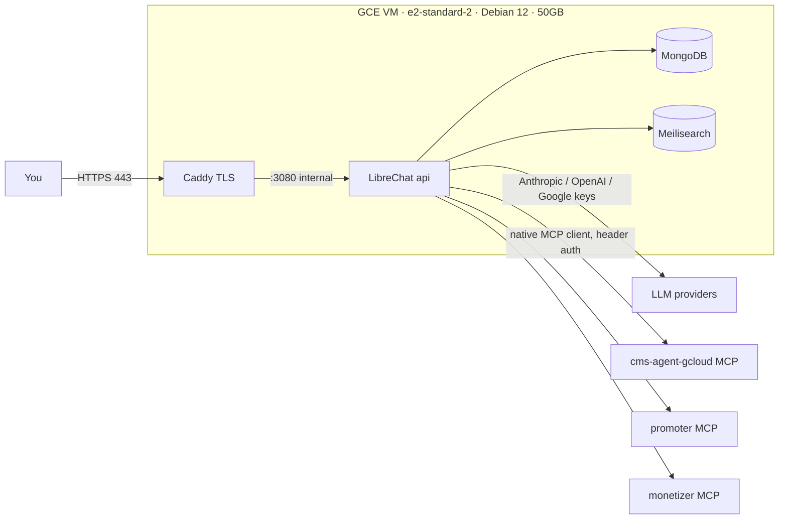

# LibreChat — self-hosted agent cockpit for the MCP stack

Deployment kit that stands up **self-hosted LibreChat on GCP** as the human
cockpit for the already-running MCP stack. LibreChat here is a **consumer** of
the MCP servers — it does not replace, wrap, or re-implement any engine.

> **Scope / non-goals.** This directory is entirely additive deployment tooling.
> It touches **no engine source** and changes **no pipeline or publishing
> behavior** in CMS-Agent / Promoter / Monetizer. Out of scope (per spec):
> Langfuse/OTEL, NocoBase, any builder-agent roster beyond the smoke agent, and
> any change to the engine repos. Publishing stays disabled at the project-policy
> level and this deployment does not change it.

---

## What was verified live (from the authoring environment)

The `cms-agent-gcloud` MCP endpoint was reachable and returned real data at
authoring time — so the wiring below targets a confirmed-good endpoint:

- **Endpoint:** `https://cms-agent-mcp-itbzhq23nq-uc.a.run.app/mcp` responds.
- **Workspace:** the real **21-node pipeline** (`input_triage` → … →
  `publish_executor`), **20 active + 1 draft**; risk split **15 read / 4 write /
  2 publish**. `publish_executor` is the lone draft (activation-gated by design).
- **History:** 3 completed runs, no rubrics/datasets/baselines yet (matches the
  F3 note at the bottom).
- **Auth model:** bearer token + session (`Mcp-Session-Id`), i.e. the
  `Authorization: Bearer ${...}` header pattern used in `librechat.yaml`.

What **cannot** be done from the authoring sandbox (and is therefore the
operator's to run): creating the GCE VM (needs your GCP project + billing),
DNS/TLS on a domain you control, and the browser-driven provider/UI checks.
Everything needed to do those is in this directory. Where a step can only be
confirmed by you, the runbook says so rather than pretending.

---

## Architecture



Firewall exposes **443 only**, and only to your allowed IP range. Port 3080 is
never published to the host. MongoDB/Meilisearch have no published ports.

---

## Prerequisites

1. A GCP project with billing enabled and the `gcloud` CLI authenticated.
2. A **domain you control** and the ability to create a DNS record for it.
3. Provider API keys: **Anthropic**, **OpenAI**, **Google (Gemini)**.
4. MCP credentials: `CMS_AGENT_KEY`, the **promoter** URL + `X-Promoter-Key`,
   and the **monetizer** token.
5. For the default TLS path: a **Cloudflare API token** (Zone → DNS → Edit) for
   the domain's zone. (Different DNS host? See *TLS choices* below.)

---

## Runbook

### Step 1 — Host

```bash
export PROJECT=your-gcp-project-id
export ALLOWED_SOURCE_RANGES=203.0.113.10/32   # your office/VPN egress IP(s)
./scripts/provision-gcp.sh
```

Creates the VM (`e2-standard-2`, Debian 12, 50GB), reserves a static IP, installs
Docker + the Compose plugin via startup script, and opens **443 only** from
`ALLOWED_SOURCE_RANGES`. Point your domain's **A record** at the printed static IP.

Then get this directory onto the VM (clone the repo or `scp deploy/librechat/`),
and `cd` into it.

### Step 2 — Secrets + config

```bash
cp .env.example .env
./scripts/gen-secrets.sh          # prints CREDS_KEY / CREDS_IV / JWT_* / MEILI_MASTER_KEY
# paste those five lines into .env, then fill in DOMAIN, ACME_EMAIL, provider keys,
# MCP keys, and CLOUDFLARE_API_TOKEN.
```

`CREDS_KEY` = 64 hex chars, `CREDS_IV` = 32 hex chars, JWT secrets = 64 hex chars.
**Never reuse the values from the LibreChat docs, and never commit `.env`** (the
`.gitignore` here already excludes it).

### Step 3 — Bring it up

```bash
docker compose up -d
docker compose logs -f caddy   # watch the certificate get issued via DNS-01
docker compose logs -f api     # watch LibreChat boot and load librechat.yaml
```

Browse to `https://<your-domain>`. Confirm the padlock (valid TLS) **before**
going further — if TLS/auth isn't working, **stop and report** (STOP CONDITION).

### Step 4 — Auth (create account, then lock down)

1. With `ALLOW_REGISTRATION=true` (default), register your account in the browser.
2. Edit `.env` → `ALLOW_REGISTRATION=false`.
3. `docker compose up -d` (recreates `api`). Confirm new registration is now closed
   and your login still works over HTTPS.

### Step 5 — Providers (multi-provider is a hard requirement)

With `ANTHROPIC_API_KEY`, `OPENAI_API_KEY`, `GOOGLE_KEY` set in `.env`, all three
appear as selectable endpoints. **Verify a plain chat returns a response from EACH
provider** before moving on. A failing key is a STOP CONDITION — report it.

### Step 6 — Confirm the three MCP servers expose tools

Two independent checks:

**CLI (fast, UI-independent):**
```bash
set -a; source .env; set +a
./scripts/mcp-smoke.sh
```
Prints per-server tool counts by doing the real `initialize → tools/list`
handshake. `cms-agent-gcloud` must list workspace/node/skill/improvement tools.
**Any server showing 0 tools is a STOP CONDITION** — fix before proceeding.

**UI:** Agents → new agent → **Tools** → each of `cms-agent-gcloud`, `promoter`,
`monetizer` should expand and list its tools.

### Step 7 — Smoke agent

Build **Workspace Inspector** exactly as specified in
[`agents/workspace-inspector.md`](agents/workspace-inspector.md) — read-only tools
from `cms-agent-gcloud` only. Ask it to *"list the workspace nodes and summarize
the pipeline."* **PASS = it returns the real 21-node pipeline** (answer key is in
that file).

---

## Persistence check (required)

```bash
docker compose down     # NOTE: no -v
docker compose up -d
```
Your account, conversations, and agents must still be there. Named volumes
(`mongodb_data`, `librechat_uploads`, `librechat_images`, `meili_data`,
`caddy_data`) survive `down`/`up`; only `down -v` destroys them.

---

## TLS choices

- **Default — DNS-01 (Cloudflare).** Real Let's Encrypt cert **without** opening
  port 80, so the firewall stays locked to 443-from-your-IP. Needs the Cloudflare
  DNS module (built in `Dockerfile.caddy`) + `CLOUDFLARE_API_TOKEN`. Other DNS
  host: swap the module in `Dockerfile.caddy` and the `dns` directive in `Caddyfile`.
- **Fallback — HTTP-01.** Simplest, but requires inbound **:80 from the public
  internet** for the ACME challenge (less private). Steps are in the `Caddyfile`
  comments and `provision-gcp.sh`.
- **Enterprise — GCP HTTPS LB + IAP.** Truly private, identity-gated, Google-managed
  cert, no public ACME. More wiring; not scripted here.

---

## Troubleshooting → STOP CONDITIONS

Per spec, **report rather than working around** when:

| Symptom | Likely cause | Report contains |
|---------|--------------|-----------------|
| An MCP server lists **0 tools** after restart | wrong URL / header name / token; server down | server name + the `mcp-smoke.sh` / api-log error |
| A **provider** chat fails | bad/again-provided key, quota, wrong var name | provider + error |
| **TLS** not issued | DNS not propagated; wrong Cloudflare token/zone; :80 blocked on HTTP-01 | Caddy logs |
| **Login** fails over HTTPS | `DOMAIN_CLIENT`/`DOMAIN_SERVER` mismatch; missing JWT secrets | api logs |

Common fixes: MCP header for `monetizer` may not be `Authorization: Bearer` — if it
lists 0 tools, confirm the header name it expects and update `librechat.yaml`.
`promoter` needs its real `PROMOTER_MCP_URL` (the spec shipped a placeholder).

---

## Security notes (carry into every later agent)

- Give each agent the **smallest** tool subset that does its job — never "all tools".
- Write/publish-risk tools go only to agents you deliberately intend to have them.
- `publish_executor` is draft/activation-required **by design** — do not activate it.
- Do **not** wire `optimizer.promote` (or any promote/publish tool) into an
  autonomous agent. Publishing stays disabled at the project-policy level.

---

## Deliverable — fill in after you run it

```
HOST + URL:            GCE e2-standard-2 (Debian 12, 50GB) @ https://<your-domain>
Providers verified:    Anthropic [ ]   OpenAI [ ]   Google/Gemini [ ]   (plain chat OK from each)
Per-MCP tool counts:   cms-agent-gcloud = ___   promoter = ___   monetizer = ___
Smoke-agent result:    Workspace Inspector -> lists real 21-node pipeline?  PASS / FAIL
Servers exposing 0 tools (with error):  ______________________________________
TLS / auth working:    yes / no
```

---

## Note — F3 (regression gate) status, for the record

Not fully done, and **not a blocker for this deployment**.
`evaluation.run_regression` and `evaluation.list_regression_reports` shipped as
callable MCP tools (reports-only, baseline compare, improved|held|regressed), but
nothing fires them automatically on a prompt/model change — it's a manual gate.
The workspace currently has no rubrics/datasets/eval-results/baselines and only 3
runs of history, so the gate has no evidence to act on yet. Intended sequence:
accumulate run history via LibreChat → create rubrics + build datasets → set a
first baseline → then wire automatic firing.
