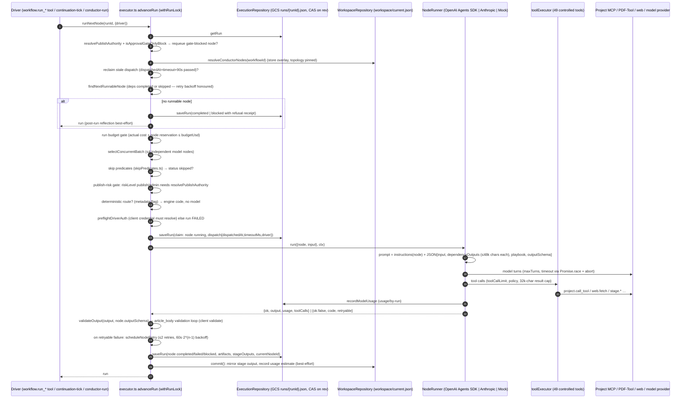

# CMS-Agent — Agent Architecture

Status: current as of commit `40424c4` (2026-09-05). Covers agents, the Publishing Conductor and its sibling workflows, stages, skills, tools, memory and learning. Evidence classes as in [ARCHITECTURE.md](ARCHITECTURE.md). Publishing specifics: [PUBLISHING_ARCHITECTURE.md](PUBLISHING_ARCHITECTURE.md). Data shapes: [DATA_ARCHITECTURE.md](DATA_ARCHITECTURE.md).

## 1. Agent types

| Type | What it is | Where defined | Created by | Runs on | Evidence |
|---|---|---|---|---|---|
| **Workflow node** ("stage agent") | One model turn-loop with a prompt, JSON output schema, allowed controlled tools, assigned skills and model config; nodes form a DAG per workflow | Canonical literals: `src/agent/workspace/nodes.ts` (25, publishing), `captureConductorNodes.ts` (16), `cloneConductorNodes.ts` (18), `visualIdentityNodes.ts` (2) — overlaid by the store document in store mode | `workspace.create_node` / `clone_node` for non-canonical nodes (never executed by a conductor: `resolveConductorNodes` maps only canonical ids); canonical nodes only via code + `npm run nodes:update` | `OpenAINodeRunner` (OpenAI Agents SDK; also Google/openai-compatible via `providerRegistry.ts`), `AnthropicNodeRunner` (native Messages API), `MockNodeRunner` | IMPLEMENTED · TESTED |
| **Deterministic stage** | A node whose `metadata.*Deterministic` flag routes dispatch into engine code with no model turn (placement, contract intelligence, publish payload, publication controller, publish executor, release executor, learning recorder, capture/clone stages, artifact/visual materializers) | `executor.ts` `DETERMINISTIC_ROUTE_METADATA_KEYS` (`:1178-1194`) + route modules | same as nodes | executor in-process | IMPLEMENTED · TESTED |
| **Conversational agent** (`client_manager`) | Single-turn chat primitive for tenant admin chats: prompt + provider + model + limits, revisioned (`rev`) | `src/agent/conversations/agentDefinitions.ts` (seed) → `workspace/current.json.conversationalAgents` | seeded on read (`ensureConversationalAgentSeeds`); `agent.update` | `ConversationalRunner` via `agent_converse`; provider = OpenAI Chat Completions or Anthropic Messages (`conversationProviders.ts`) | IMPLEMENTED · TESTED |
| **Synthetic improvement nodes** | Reflector, curator, judge — ad-hoc nodes run through the same runner registry | `improvement/{optimizer,curator,rubricJudge}.ts` | on demand by `optimizer.propose`, `playbook.curate`, `evaluation.run` | node runners | IMPLEMENTED · TESTED (mock mode) |
| **Legacy base agent** | `createAgent()` returns a plain object (model name + instructions + skills + MCP server list); `runAgent` calls deterministic skill stubs, never a model | `src/agent/runtime/{createAgent,runAgent}.ts` | `netlify/functions/agent.mts` only | nowhere in production | **LEGACY** — README/AGENTS.md's "reusable base agent" describes this scaffold |
| **Tenant plugins / chat agents** (ChatGPT "Dr. Lurie Skincare" agent etc.) | Human-driven agents that publish directly over the tenant `/mcp` | outside this repo | — | — | Out of scope; they do not use CMS-Agent workflows |

## 2. Agent execution (one node dispatch)

Key files: `src/agent/workspace/executor.ts` (`advanceRun` `:1402`, `executeRunnableNode` `:1610`), `src/agent/execution/runners/OpenAINodeRunner.ts`, `AnthropicNodeRunner.ts`, `src/agent/tools/toolExecutor.ts`, `src/agent/workspace/skipPredicates.ts`, `nodeRetryPolicy.ts`, `publishDecision.ts`.

### 2.1 Context construction

Per dispatch the runner builds: system instructions (fixed preamble, node name/description, **run context** rendered from `runContext.ts` — request id, project facts, editorial subject —, the node prompt, and a secrets warning) and a user message that is JSON of `{ input, dependencyOutputs, playbook, outputSchema }`. `dependencyOutputs` are the `stageOutputs` of `node.dependsOn` (skipped dependencies delivered as an explicit ledger), each shape-preservingly truncated to `DEPENDENCY_OUTPUT_MAX_CHARS` (48 000) with a `__truncation` ledger the model can cite. Assigned skills are resolved by `skillResolver.ts` into instructions (`node.get_effective_prompt` shows the assembled text). The per-node ACE **playbook** (`improvement/playbooks/{nodeId}.json`) is rendered into the prompt on every dispatch. Image refs become content blocks (`imageRefs.ts`). Tool schemas are derived from controlled tool definitions (`toolJsonSchema.ts`). Output is requested as strict-false `json_schema` matching `node.outputSchema`.

### 2.2 Model selection

`modelConfig.provider` (`openai` default, `anthropic`, `google`, `openai_compatible`) picks the runner/provider (`providerRegistry.ts`); `modelConfig.model` picks the model, falling back to `OPENAI_AGENT_MODEL` (`gpt-5.5`) or `ANTHROPIC_MODEL`. Store-mode `modelConfig` overrides canonical. `IMPROVEMENT_MODEL_LADDER_ENFORCE` (default off) may swap in the cheapest eval-qualified model per run (`modelLadder.ts`). Truncation retry doubles `max_output_tokens` once, bounded by `*_MAX_OUTPUT_TOKENS_CEILING`.

### 2.3 Tools

Nodes call only **controlled tools** (`src/agent/tools/toolRegistry.ts`, 49 ids such as `stage.get_output`, `project.call_tool`, `project.call_read_tool`, `web.fetch`, `capture.*`, `clone.*`, `pdf_template.*`, `library.*`, `monetize.ev_floor`). Effective tools per node = `node.allowedTools` ∩ registry, filtered by skill tool policy and risk (`toolResolver.evaluateToolsForNode`). `toolCallLimit` is enforced per execution; results over `TOOL_RESULT_MAX_CHARS` are truncated explicitly. Mutating file/artifact/blob tools carry `requiresApproval: true` and are denied inside runs unless `approvedToolIds` is supplied; no run-driving MCP surface (`workflow_*`, `node_execute`) supplies it (`tool_test` and `node_get_effective_tools` accept it for one-off tests), so these tools are effectively unavailable to autonomous nodes. `project.call_tool` forwards to the tenant subject to the project's tool policy (allowed / needs_approval / blocked). The tool-execution audit is an in-process map; the durable record is the per-node `toolCalls[]` stub list on the run.

### 2.4 Retries, cancellation, approvals, failure recovery

| Concern | Mechanism | Evidence |
|---|---|---|
| Transient runner failure | `decideNodeRetry`: only `RETRYABLE_RUNNER_ERROR_CODES` (timeouts, provider 5xx/429…), max 2 orchestrator retries, backoff 60 s·2^(n−1), node stays `queued` with `retry{notBefore}`; `run.retryBackoffUntil` tells the tick when to come back | `nodeRetryPolicy.ts`, `orchestratorRetry.test.ts` |
| Operator retry | `workflow.retry_node` / `node.retry`: requeues the node (attempt history appended, `skipOverride` set for skipped nodes) and advances once | `executor.retryNode :3207` |
| Driver death mid-node | Dispatch claim with timeout; next driver reclaims after `timeout + 90 s`; long validation phases re-stamp the claim; `assessRunStall` explains the state | `executor.ts:1431-1448`, `runStallHeartbeat.test.ts` |
| Cancellation | `workflow.cancel_run` sets the run status under `withRunLock`; `node.cancel` sets the run to `cancelled` and every non-completed node to `cancelled` with a direct `saveRun` (outside the lock, CAS still applies). An in-flight model call in another driver is **not** aborted; its later CAS save fails and the output is discarded (cost already recorded) | `mcp/workspace/tools.ts:640,826` |
| Pause/resume | `paused` is a distinct halted status; `resume_run` re-queues the run (not blocked nodes) | R-18 comments in `executionTypes.ts` |
| Publish approval | Publish-risk nodes (`riskLevel` publish/admin) dispatch only when `resolvePublishAuthority(run).authorized` — operator `approved` on the run, or `publishingPolicySnapshot.autonomyMode === "autonomous"`. Otherwise the run blocks with an `approvalsRequired` entry (look-ahead `pending: true` before the attempt). Any later advance self-heals once approval lands | `publishDecision.ts`, `executor.ts:1424`, `approvalGateStateMachine.test.ts` |
| Budget | Per-run `budgetUsd` (actual cost + next node's declared budget) halts the run as `blocked` + `budgetBlock`; per-node `budgetUsd` guard inside the runner (`budgetGuard.ts`); `workflow.set_node_budget_override` | `budgetGate.test.ts`, `openaiNodeRunnerBudgetGuard.test.ts` |
| Client auth failure | `preflightDriverAuth` / `failNodeOnClientAuth`: run fails immediately, nothing downstream dispatched | `executor.ts:1591-1607`, `clientAuthFailFast.test.ts` |
| Missing endpoint env in a driver | `preflightDriverEnv` records `driver_env_missing:<VAR>` and refuses to dispatch (other drivers may) | `driverEnvPreflight.ts` |
| Stall/silence | Tick ledger + `driverHealth`; three silent ticks ⇒ `driver_silent_since` on the run and job exit 1 | `driverHealth.ts`, `tickLedgerDriverSilence.test.ts` |

### 2.5 State persistence, concurrency, idempotency

The run record is the only execution state (`executionTypes.ts`). Every node transition is one CAS `saveRun`; four drivers coordinate purely through CAS + claims ([DATA_ARCHITECTURE.md](DATA_ARCHITECTURE.md) §5). Idempotency exists only where a ledger was built: `agent_converse` (claim per `(conversation_id, turn_id)`), release (`releaseLedger` per `${runId}:${requestId}` with the site-side `idempotencyKey`), artifact adoption (`artifactMaterialization.ts` adopt-or-create), and the tenant object shell (`contentItemShell.ts`, reuse of the existing object for the same request id). Node model calls themselves are **not** idempotent: a reclaimed-then-finished node pays twice.

## 3. Workflows and stages

| Workflow id | Nodes | Purpose | Registered in | Composition |
|---|---|---|---|---|
| `publishing_conductor` | 25 | DTC article: triage → placement → topic/monetization/reader → research → objections → narrative → angle → brief → draft → 4 reviewers (concurrent) → aggregator → contract intelligence → artifact plan/materializer → article_body → **publishing tail** | `workflowRegistry.ts:39` | canonical literal `nodes.ts` |
| `capture_conductor` | 16 | Crawl → map → classify → refine → theme → emit (dry, live) → score → adjudicate → report → tail | `captureConductorWorkflow.ts` | `composeWorkflowNodes` + `publishingTail.ts` |
| `clone_conductor` | 18 | Intake → layout/recipe design → mint → theme bind → fit → restamp → PDF template intake/design/mint/publish → report → tail | `cloneConductorWorkflow.ts` | same |
| `visual_identity` | 2 | `brand_imagery_writer` → `visual_standard_materializer` (deterministic) | `visualIdentityWorkflow.ts` | — |

The **shared publishing tail** is `publish_payload → publication_controller → publish_executor → release_executor → learning_recorder` (`publishingTail.ts`); the three publishing workflows share these node ids, so a store edit to a tail node reaches all of them, and a workflow-owned stage route (`captureStageDeterministic` / `cloneStageDeterministic`) outranks the tail's DTC routes (`executor.ts:1195-1240`). Registration is by side-effect import; only code that imports `executor.ts` (or the route modules) sees all four workflows. An unknown `workflowId` on a run falls back to `publishing_conductor`.

Stage transitions: nodes are `queued → running → completed | failed | blocked | skipped | cancelled`; a run is `queued → running → completed | failed | blocked | cancelled | paused` (`HALTED_EXECUTION_STATUSES`). "completed" is set only in `advanceRun`'s no-runnable-node branch; a run whose publish node still holds a refusal receipt is forced back to `blocked` (T5 fix 2). Late-stage entry (`entrypoint{nodeId, output}`) seeds the entry node and ancestors as completed after validating the supplied output against the node's schema.

Gates with stable ids are declared in `gateRegistry.ts` (per workflow × node) so approvals can address one gate.

## 4. Skills

CMS-Agent's `execution/nodeInstructions.ts` supplies the same node-plus-skill instruction core to
`node.get_effective_prompt`, `OpenAINodeRunner` (including compatible providers), and
`AnthropicNodeRunner`. Active skills are loaded at dispatch in assignment order, once per unique
skill ID. Draft/deprecated skills produce warnings and contribute no instructions. Missing assigned
skills or schema contradictions detected by the existing compatibility checker refuse provider
dispatch with `invalid_node_configuration`. The preview contains the node prompt once and exposes
skill-only text separately; provider wrappers, run context and playbooks remain separate. This is
instruction composition, not enforcement of every skill completion criterion or a new tool grant.

The DTC workspace handoff corrections are documented in
[DTC_CAPABILITY_REPAIRS.md](DTC_CAPABILITY_REPAIRS.md). Their live authoring patches are separate
from the code deployment; canonical node literals have deliberately not been re-seeded.

13 seeded skills (`skills/seededSkills.ts`: `article_body_builder`, `article_structuring`, `artifact_handling`, `contract_intelligence`, `editorial_craft`, `editorial_review`, `factual_review`, `learning_observation`, `publication_readiness`, `seo_review`, `source_verification`, `web_research`, `structure_studio_standards_pack`). A skill is a versioned document (instructions, schemas, allowed tools, tool policy, memory policy, risk level) stored in `skills/*` with snapshots and events; `skill.assign` writes `node.assignedSkills`. Resolution (`skillResolver.resolveSkillsForNode`) filters by status and risk and contributes instructions + tool constraints. The `standardsPack.ts` skill carries a section-type registry snapshot for the structure studio. Skills never execute code.

## 5. Memory

| Memory | Implemented? | Read by | Written by |
|---|---|---|---|
| Run-scoped cache (`conductor.ts` `RunScopedCache`) — reduced client contract, editorial voice, run context | IMPLEMENTED, in-process per run, failures not cached | prefetch modules | prefetch modules |
| Cross-run reduced-contract cache (`workspace/current.json.reducedContractCache`, cap 20) | IMPLEMENTED | `contractPrefetch.ts` | same |
| Client memory (`memory/{projectId}.json`) — finished templates per tenant | IMPLEMENTED | `client_memory.list_templates` tool | clone `report` stage |
| Template library (`library/…`) — cross-tenant recipes | IMPLEMENTED | `library.*` tools | `library.publish_template` |
| Learning observations (workspace document) | IMPLEMENTED (record/list/archive) | curation only | nodes, publisher, termination hook |
| Playbooks (`improvement/playbooks/{nodeId}.json`) | IMPLEMENTED | **every node dispatch** | curation / migration / deltas |
| `MemoryEnvelope` / `JsonMemoryAdapter` (`src/agent/memory/{memoryEnvelope,JsonMemoryAdapter}.ts`) | LEGACY — used only by `runAgent.ts` | `/api/agent` | same |
| Vector store / semantic retrieval | NOT IMPLEMENTED | — | — |

## 6. Learning observations and provenance

`learning.record_observation` (controlled tool and MCP tool) stamps `runId`/`nodeId` from the executing context into both top-level fields and `metadata` (`store.ts:594-604`), so an observation cannot forge its origin. Provenance says *where* an observation came from, not *whether it is true*. Three sources write observations and they are not equal: (1) `recordTerminationObservations` (`executor.ts:1123`) — engine-generated from run facts (blocked/failed/completed), measured; (2) `publishRun` — publish executed/failed, measured, **but only on the engine path** (`publishExecutorDeterministic: "execute"`), which canonical code does not select; (3) `learning_recorder` (tail) — a **model turn** by canonical default: `learningRecorderDeterministic` is set by no canonical literal (`nodes.ts`, `cloneConductorNodes.ts`; the capture file only mentions it in a comment), so unless a store row opts in, its "structured observations and improvement candidates" are the model's own account of the run, not a templated fact record (`executor.ts:2494-2498`). Consumers (`optimizer_analyze`, playbook curation, the attention feed) do not distinguish the three. Observations are soft-deleted only. Node outputs carry `provenance{promptVersion, model, capturedAt}` stamped at execution.

## 7. Current learning behaviour (IMPLEMENTED)

1. **Playbook injection** — the only path by which learned information changes a later run: both runners read `improvement/playbooks/{nodeId}.json` and render it into the prompt. Playbooks change via `playbook.apply_delta` (explicit), `playbook.curate` (mock heuristic from worst rubric criterion, or `openai` curator model), `playbook.migrate_observations` (observations → bullets).
2. **Evaluation substrate** — rubrics per node, LLM-as-judge (`evaluation.run`, judge cost lands as `improvement_judge` usage), pairwise trials, regression reports, feedback records (human approvals/edits, Monetizer and tracking outcomes via ingestion jobs).
3. **Optimizer** — `optimizer.analyze` → `propose` (GEPA-style prompt mutation, propose-only) → `run_trial` (champion/challenger replay over frozen datasets) → `promote` (human call; versioned mutation of the node prompt through the change funnel, reversible via `changes.restore`).
4. **Model ladder** — advisory recommendation (`optimizer.status`); enforcement only with `IMPROVEMENT_MODEL_LADDER_ENFORCE`.

## 8. Future self-learning architecture (flag-gated or ASPIRATIONAL)

| Capability | State | Gate |
|---|---|---|
| Automatic post-run reflection (propose-only) | IMPLEMENTED, default OFF | `IMPROVEMENT_POST_RUN_REFLECT` (+ mode `mock`/`openai`) |
| Automatic eval-gated promotion for low-risk nodes | IMPLEMENTED, default OFF | `IMPROVEMENT_AUTO_PROMOTE` |
| Fine-tuning flywheel | REPORT-ONLY (`dataset.finetune_readiness`); no tuning job | — |
| Closed loop from tenant analytics to prompts | Ingestion exists (`feedback.ingest_tracking/monetizer`) → feedback outcomes → `optimizer.analyze`; no automatic actuation | scheduling of ingest jobs UNKNOWN |
| Autonomous playbook curation | `playbook.curate` is manual (MCP call) | — |

**The repo cannot show that production learns autonomously.** No deploy artifact sets the improvement flags (`cloudbuild.deploy.yaml` does not), so unless they were set by hand on the service the loop is human-triggered. Do not document CMS-Agent as self-improving without checking the live environment (`gcloud run services describe cms-agent-mcp --format='value(spec.template.spec.containers[0].env[].name)'`).

## 9. Concurrency assumptions an agent must respect

- One dependency-ready node per advance, except the reviewer quartet batch (`CONCURRENT_DISPATCH_LIMIT = 4`), which shares one claim save and one reconciliation save.
- Deterministic routes never run concurrently and several read stage outputs outside their `dependsOn`.
- The continuation tick drives at most 5 runs per tick, 100 steps per run, within a time budget (45 s code default; the runbook deploys the job with `CONTINUATION_TICK_BUDGET_MS=240000`) and a 300 s task deadline margin; it will defer a dispatch whose timeout would outlive the task.
- `agent_converse` duplicates wait up to `timeout_ms + 5 s` polling the claim every 20 ms.
