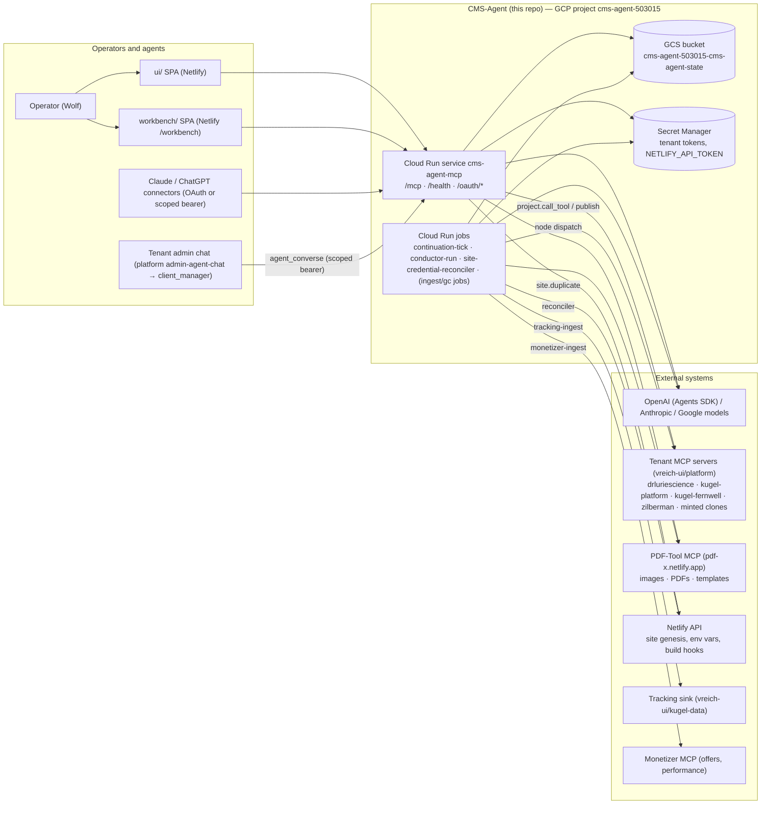
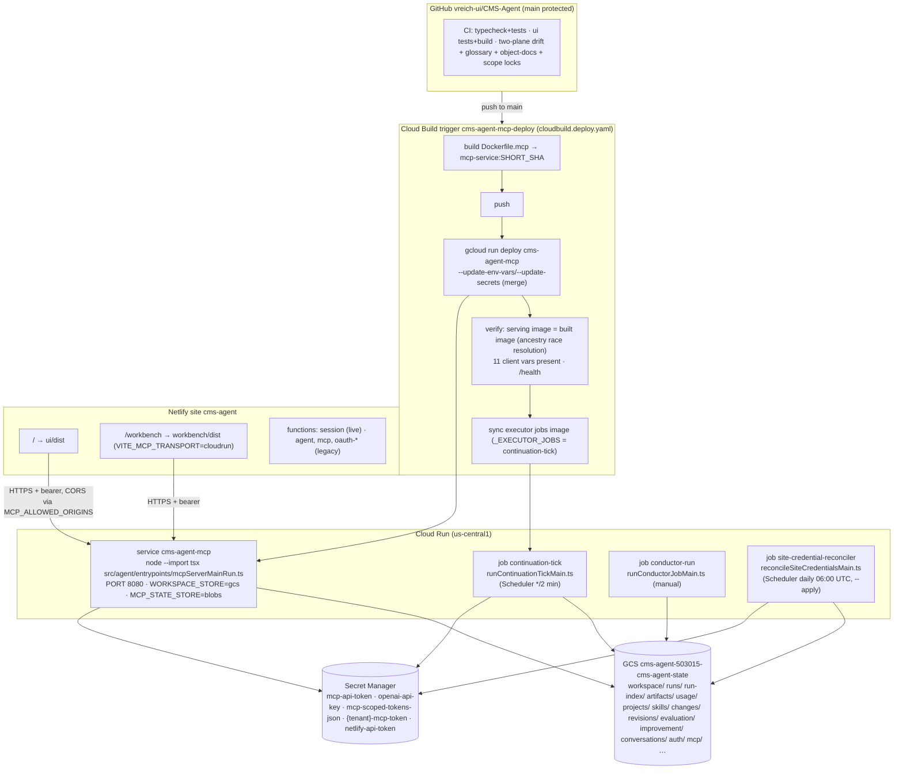

# CMS-Agent — System Architecture

Status: **current as of commit `40424c4` (2026-09-05)**, reconstructed from source. Evidence classes used throughout: **IMPLEMENTED** (verified in executable code), **TESTED** (exercised by `tests/`), **DEPLOYED** (backed by a deployment artifact in this repo), **DOCUMENTED** (stated only in docs), **LEGACY** (retained compatibility code), **ASPIRATIONAL** (intended, not built), **UNKNOWN** (repo cannot tell). Where docs and code disagree, code wins and the disagreement is listed in [KNOWN_ISSUES.md](KNOWN_ISSUES.md) §D.

Documentation hierarchy: [README](../README.md) → this file → domain docs ([DATA](DATA_ARCHITECTURE.md), [AGENT](AGENT_ARCHITECTURE.md), [MCP](MCP_ARCHITECTURE.md), [PUBLISHING](PUBLISHING_ARCHITECTURE.md), [DEPLOYMENT](DEPLOYMENT.md), [SECURITY](SECURITY.md), [OBSERVABILITY](OBSERVABILITY.md)) → references ([MCP_TOOLS](reference/MCP_TOOLS.md), [DATA_ENTITIES](reference/DATA_ENTITIES.md)) → code. Each fact has one home; other files link to it.

## 1. What CMS-Agent is

CMS-Agent is a TypeScript **workspace and orchestration plane** that runs multi-node agent workflows ("conductors") which research, write, review, materialize media for, and publish content into external **tenant sites**. Each tenant site (Dr. Lurie, Kugel Platform, Fernwell, Zilberman, genesis-minted clones) runs its own MCP server from the separate `vreich-ui/platform` repo; those servers — not CMS-Agent — own published content. CMS-Agent exposes one Streamable-HTTP MCP endpoint through which humans, connectors (Claude, ChatGPT), the two SPAs and other agents program the workspace and drive runs.

Three things are easy to get wrong about it:

1. **It is a Google Cloud Run system with GCS state.** Netlify hosts only the two SPAs. Everything under `netlify/functions/` is legacy (§3, §5).
2. **Node behaviour is configuration, not code, by default.** `WORKSPACE_NODES_SOURCE` defaults to `store` (`src/agent/workspace/executor.ts:338`): prompts, schemas, tool grants, model config and the deterministic-route metadata flags come from `workspace/current.json` in GCS, overlaid on the compiled canonical node list (`overlayStoreNode`, `executor.ts:346-363`, merges `metadata` per key). Everything the overlay does not name — `id`, `kind`, `dependsOn`, `produces`, `requiredInputs`, `riskLevel`, `status`, `position` — stays pinned to code.
3. **"dryRun" in a run record means nothing.** Every `WorkflowExecutionRecord` carries the literal `dryRun: true` (`src/agent/workspace/executionTypes.ts:287`); workflow runs are created through `startDryRun()` (`executor.ts:945`, reached from `workflow_start_dry_run`, `site_duplicate`, the capture→clone chain and the conductor job CLI; `node_execute` creates a separate `independent_node` run). The default `executionMode` is `"openai"` and a run can publish live when its gates pass ([PUBLISHING_ARCHITECTURE.md](PUBLISHING_ARCHITECTURE.md)).

## 2. System context

Evidence: entrypoints in `src/agent/entrypoints/`; tenant endpoints in `cloudbuild.deploy.yaml:101`; PDF-Tool and Monetizer as registered projects in `src/agent/projects/{pdfTool,monetizer}/definition.ts`; tracking sink in `src/agent/improvement/trackingIngest.ts`; Netlify API in `src/agent/capture/siteGenesis.ts:326-420`.

## 3. Runtime topology

Every deployable component, with its evidence class. "Failure boundary" = what breaks when it is down.

| Component | Responsibility | Entrypoint | Hosting | Inbound | Outbound | Auth | Persistence | Failure boundary | Status |
|---|---|---|---|---|---|---|---|---|---|
| **MCP control-plane service** `cms-agent-mcp` | Serves the workspace MCP (151 tools), OAuth 2.1 AS, health; runs in-request node advances (`workflow.run_*`) | `src/agent/entrypoints/mcpServerMainRun.ts` → `mcpServerMain.ts` → `mcp/http/controlPlaneRouter.ts` | Cloud Run service, us-central1, `--allow-unauthenticated`, min 1 / max 4 instances (per `cloudbuild.deploy.yaml`) | HTTPS `POST /mcp`, `/api/mcp`, `DELETE /mcp`, `GET /health`, OAuth paths | GCS, Secret Manager, model providers, tenant MCPs, PDF-Tool, Netlify API, Cloud Run Jobs API | Bearer: static `MCP_API_TOKEN`, OAuth access token, or scoped bearer (static JSON or managed registry) — [MCP_ARCHITECTURE.md](MCP_ARCHITECTURE.md) §3 | GCS (all repositories + sessions + OAuth state) | All API access, all in-request run driving, chat turns (`agent_converse`) | IMPLEMENTED · DEPLOYED · TESTED (router + endpoint) |
| **continuation-tick** job | Every ~2 min scans all runs and advances `queued`/`running` ones through the same `runNextNode`; writes tick ledger + driver-health stamps | `runContinuationTickMain.ts` → `runContinuationTickJob.ts` → `workspace/runContinuation.ts` | Cloud Run Job, Cloud Scheduler `*/2 * * * *` (docs/platform/CONTINUATION_TICK.md) | Scheduler trigger | Same as service | Runtime service account | GCS | Runs stop advancing after the caller's 45 s window; `driver_silent` after 3 silent ticks exits 1 (tick budget: 45 s code default, 240 s in the runbook's deploy command) | IMPLEMENTED · DEPLOYED (image synced by `cloudbuild.deploy.yaml` `_EXECUTOR_JOBS`; env set by hand per runbook) · TESTED |
| **conductor-run** job | Drives ONE run to a terminal state (long runs, `--run` resume, `--approved`) | `runConductorJobMain.ts` → `runConductorJob.ts` | Cloud Run Job (`Dockerfile` ENTRYPOINT); created by hand (`docs/platform/PHASE1_RUNBOOK.md`) | `gcloud run jobs execute` args/env | Same as service | Runtime SA | GCS | Only that execution | IMPLEMENTED · TESTED · **DEPLOYMENT UNVERIFIED** — evidenced only by the Blobs-era runbook and a 2026-08-04 cost note (`docs/plan/HANDOFF.md:514`); no deploy artifact creates it and it is not in `_EXECUTOR_JOBS`, so if it exists it runs a stale image (KNOWN_ISSUES I-3) |
| **site-credential-reconciler** job | Re-mints tenant Client Manager scoped bearers and installs them on Netlify sites | `reconcileSiteCredentialsMain.ts` → `capture/siteCredentialReconciler.ts` | Cloud Run Job + Cloud Scheduler daily 06:00 UTC (`scripts/deploy-site-credential-reconciler*.sh`) | Scheduler, or `site_credentials_apply` MCP tool via Cloud Run Jobs API | Netlify API, GCS, Secret Manager | Runtime SA | GCS `auth/managed-scoped-bearers.v1.json`, `projects/` | Tenant chat credentials drift until next run | IMPLEMENTED · DEPLOYED · TESTED |
| **migrate-store**, **conversation-turn-gc**, **monetizer-ingest**, **tracking-ingest** jobs | One-off Blobs→GCS migration; bounded GC of superseded chat turns; outer-loop feedback ingestion | `migrateStoreJobMain.ts`, `conversationTurnGcJobMain.ts`, `monetizerIngestJobMain.ts`, `trackingIngestJobMain.ts` | Cloud Run Job candidates; **no deploy artifact in repo** | CLI flags/env | GCS; Monetizer MCP; tracking sink | Runtime SA | GCS | none (best-effort) | IMPLEMENTED · TESTED · DEPLOYMENT UNKNOWN |
| **ui/** SPA | Operator workspace: overview, constellation graph, agents, runs, changes, access, settings | `ui/src/main.tsx` | Netlify site `cms-agent`, `/` | Browser | Cloud Run `/mcp` directly (`VITE_CLOUD_RUN_MCP_URL`); Netlify Identity via `/api/session` | Pasted bearer (localStorage in dev) + Netlify Identity gate | none | Operator UI only | IMPLEMENTED · DEPLOYED · designated "old UI" (workbench/docs/RETIREMENT.md) |
| **workbench/** SPA | Conductor Workbench (runs, nodes, outputs, contracts) | `workbench/src/main.tsx` | Netlify `/workbench/*` (transport `cloudrun`, `VITE_READ_ONLY=0`) | Browser | Cloud Run `/mcp` directly; token in sessionStorage | Pasted bearer | none | Operator UI only | IMPLEMENTED · DEPLOYED |
| **workbench-broker** | Same-origin auth proxy (IAP or password) in front of `/mcp` for the workbench, read-only by default, 40 read + 44 mutating verbs policy | `workbench-broker/src/index.ts` | `Dockerfile.workbench` → separate Cloud Run service (Track A) | Browser | Cloud Run `/mcp`, Secret Manager | IAP JWT or password + HMAC cookie | none | Workbench only | IMPLEMENTED · TESTED · **DEPLOYMENT UNCONFIRMED** (`netlify.toml:18` says not deployed; no deploy artifact and no evidence of a runbook execution in the repo) |
| **Netlify functions** `agent`, `mcp`, `oauth-*` | Former control plane over the same core modules | `netlify/functions/*.mts` | Netlify functions (still bundled and routed) | `/api/agent`, `/api/mcp`, `/oauth/*`, `/.well-known/*` | Netlify Blobs (context) | `AGENT_API_TOKEN` / `MCP_API_TOKEN` / OAuth | Netlify Blobs (no longer the production store) | none in production | **LEGACY, STILL ROUTED** — all 8 functions deployed on the production Netlify deploy of `921367e`; live probe 2026-09-06: `/api/mcp` 502, `/api/agent` 502, `/api/session` 401 (alive), `/.well-known/oauth-authorization-server` 200 (alive; issues tokens into Netlify Blobs that the Cloud Run verifier never reads). Kept because 40 tests and the CI drift detector drive it in-process |
| **Netlify function** `session` | Identity → `ADMIN_EMAIL_IDS` check for the ui | `netlify/functions/session.mts` → `src/agent/runtime/adminSession.ts` | Netlify | `/api/session` | none | Netlify Identity | none | ui login gate | IMPLEMENTED · DEPLOYED (the only Netlify function still on a live path) |
| **deploy/librechat/** | GCE + docker-compose LibreChat kit pointed at the Cloud Run MCP | `deploy/librechat/docker-compose.yml` | GCE VM (`provision-gcp.sh`) | Browser | Cloud Run `/mcp` with `CMS_AGENT_KEY` bearer | LibreChat login | Mongo (LibreChat) | none | EXPERIMENTAL (one commit, 2026-07-23; stale node counts) |

## 4. Deployment / runtime architecture

Two deploy paths exist for the same service and they differ (`cloudbuild.deploy.yaml` 1Gi/min-1/runtime SA; `scripts/deploy-mcp.sh` 512Mi/min-0/no SA) — [DEPLOYMENT.md](DEPLOYMENT.md) §3, KNOWN_ISSUES I-1.

## 5. Component relationships (the questions people actually ask)

| Relationship | Answer (IMPLEMENTED unless noted) |
|---|---|
| Cloud Run **service** vs **jobs** | Same image, same code, same GCS bucket; `bootstrapWorkspaceStore()` (`runConductorJob.ts:70-81`) registers the GCS transport in every entrypoint so a job and the service can never bind different stores. The service drives runs only inside a 45 s request window (`RUN_DRIVER_TIME_BUDGET_MS`, `mcp/workspace/tools.ts:52-72`); the tick and the conductor job drive the rest. All four drivers stamp `dispatch.driver` on the node they run (`executionTypes.ts:43`). |
| Netlify UI vs Cloud Run | The SPAs are static files; every read/write goes over HTTPS to the Cloud Run `/mcp` with a bearer the operator pastes. Netlify Identity only gates whether the ui renders (`/api/session`). No Netlify function proxies MCP any more. |
| Netlify compatibility functions | `netlify/functions/mcp.mts` and `oauth-*.mts` are thin adapters over the same `mcpEndpoint.ts` / `oauthEndpoints.ts` cores as Cloud Run. They exist so `scripts/twoPlaneDrift.ts` and 40 tests can drive the Netlify request lifecycle in-process. `agent.mts` exposes the legacy base-agent scaffold (`runtime/runAgent.ts`) that no Cloud Run path reaches. Treat the directory as LEGACY. |
| Workspace MCP vs Publishing Conductor | The MCP is the API; the conductor is `src/agent/workspace/executor.ts` (+ routes) that the `workflow.*` tools and the job drivers call. The conductor never calls the MCP; both call the repositories. |
| Workspace MCP vs external **project MCP** servers | CMS-Agent is an MCP **server** to its callers and an MCP **client** (`src/agent/projects/mcpClient.ts`, `projectMcpAdapter.ts`) to each tenant. Content is canonical only on the tenant side ([PUBLISHING_ARCHITECTURE.md](PUBLISHING_ARCHITECTURE.md) §2). |
| Workbench vs broker | Today the workbench on Netlify talks to Cloud Run directly. The broker is the designed replacement (browser never holds an MCP credential) and is code-complete but its deployment is unconfirmed. |
| Tenant admin chat vs CMS-Agent | The platform's admin chat calls `agent_converse` with a tenant-scoped bearer minted by genesis/reconciler; CMS-Agent returns one model turn with tool-call *proposals* and never executes them ([CLIENT-MANAGER-CONTRACT.md](../CLIENT-MANAGER-CONTRACT.md)). The admin chat is the intended content surface; the MCP `workflow.*` tools are described as the operator/test surface (server `instructions` in `mcp/workspace/server.ts`) — but the credential minted for every tenant admin chat (`SITE_CLIENT_MANAGER_TOOLS`, `capture/siteGenesis.ts:123-138`, locked) also holds `workflow_start_dry_run`, `workflow_run_all`, `workflow_publish_run` and `workflow_set_operator_publish_decision`, so the tenant side can drive and approve runs directly. What the tenant does with that credential is an **external contract** (`vreich-ui/platform`). |

## 6. Source layout (what lives where)

| Path | Role | Notes |
|---|---|---|
| `src/agent/entrypoints/` | Process entrypoints: MCP server, jobs, CLI wrappers (`*Main.ts` are side-effect shells) | Keep thin; logic modules are importable without side effects (build-time startup guard in Dockerfiles relies on this) |
| `src/agent/mcp/http/` | Transport-neutral MCP endpoint (`mcpEndpoint.ts`), Cloud Run router, Netlify adapter, OAuth endpoints | |
| `src/agent/mcp/auth/`, `mcp/transport/`, `mcp/state/` | OAuth 2.1 AS, scoped bearers (static + managed), sessions, TTL KV store | |
| `src/agent/mcp/workspace/` | Tool catalog (`tools.ts` + `*Tools.ts`), JSON-RPC dispatch (`server.ts`), **workspace document store** (`store.ts`) | `store.ts` is the workspace data model, not just an MCP concern |
| `src/agent/workspace/` | Conductor: executor, node literals (`nodes.ts`, generated-locked), workflow registry, capture/clone/visual-identity compositions, publishing modules, run continuation, gating, budgets | The real orchestration layer (AGENTS.md's "src/agent/runtime" is stale) |
| `src/agent/execution/` | Node runners (OpenAI Agents SDK, Anthropic Messages, Mock), provider registry, output validator, budget guard | |
| `src/agent/tools/` | 49 controlled tools nodes may call, policy, executor (in-memory audit) | |
| `src/agent/skills/` | Skill definitions, registry (blob or memory), resolver, 13 seeded skills; **also** the legacy `contentDraft/editorialReview/seo/publish` scaffold | |
| `src/agent/projects/` | Project (tenant) registry types, admin, MCP adapter/client, Secret Manager, per-project hooks (dr-lurie, platform, fernwell) | |
| `src/agent/capture/` | Site capture/clone engines (vendored `engine/*.mjs`), site genesis, credential reconciler, MCP boundary | |
| `src/agent/repository/` | Repository interfaces + Memory and Blob implementations + GCS transport | |
| `src/agent/conversations/` | `agent_converse` runner, providers, transcript sanitiser, turn GC | |
| `src/agent/improvement/` | Evaluation, optimizer, playbooks, regression, model ladder, ingestion | |
| `src/agent/memory/`, `src/agent/library/` | Per-tenant client memory (templates) and cross-tenant template library; **plus** the legacy `MemoryEnvelope`/`JsonMemoryAdapter` used only by `runAgent.ts` | |
| `src/agent/observability/` | Usage/pricing, constellation metrics, redaction, console adapter (legacy path only) | |
| `src/agent/runtime/` | Repository manager singleton, auth header helper, Netlify Lambda Blobs glue, admin session, **legacy** `runAgent`/`createAgent` | |
| `netlify/functions/` | Legacy adapters (§3) | |
| `ui/`, `workbench/`, `workbench-broker/` | SPAs and broker | |
| `scripts/` | Drift detectors and locks (CI), store seeding/reseeding, deploy scripts, doc generators | |
| `docs/` | This documentation set; `docs/plan`, `docs/platform`, `docs/constellation` are dated plans/runbooks — see [docs/README.md](README.md) for their status |

## 7. Architecture invariants (MUST hold; agents editing the repo rely on them)

1. Every entrypoint MUST call `bootstrapWorkspaceStore()` before touching a repository when `WORKSPACE_STORE=gcs`; `getCmsAgentBlobStore()` throws otherwise (`repository/blobs/blobClient.ts:26-28`).
2. Run mutations MUST go through `withRunLock` + `saveRun` CAS (`executor.ts:762-770`, `BlobExecutionRepository.saveRun`); never write `runs/<id>.json` directly. (Known exception: `node_cancel` in `mcp/workspace/tools.ts:640` calls `saveRun` outside the lock — CAS still protects it.)
3. Workspace mutations MUST go through `WorkspaceStateStore.mutate()` so validation, version bump, revision snapshot and change event happen together (`mcp/workspace/store.ts:373-457`).
4. Publish authority MUST be resolved only by `resolvePublishAuthority` from the run's own `operatorPublishDecision` + `publishingPolicySnapshot` (`workspace/publishDecision.ts`); no caller flag may authorize a publish (ADR-2026-08-25-publish-autonomy).
5. The five publish gates in `publisher.ts` are a closed set (`PUBLISH_GATE_NAMES`); in engine code `release_to_production` is spoken only by `release_executor` (`releaseExecution.ts`). On the model path (any node holding `project.call_tool` — canonically `publish_executor`, `release_executor`, `publication_controller`, `publish_payload`, `artifact_materializer`, `contract_intelligence` and `article_body`) the prohibition is prompt-level and bounded only by the tenant's own tool policy (external contract). The wire tool `project_call_tool` (full bearer) reaches the verb with no gate. The exact conditional invariant is in [PUBLISHING_ARCHITECTURE.md](PUBLISHING_ARCHITECTURE.md) §2.0.
6. Node literals (`workspace/nodes.ts`, capture/clone/visual nodes) are locked by tests and `npm run nodes:check`; editing them requires `npm run nodes:update` + redeploy + (for prompt/schema/tool fields) `npm run store:update`.
7. The wire tool surface is locked by `docs/mcp-tool-manifest.json`; changing a tool name/description/schema requires `npm run drift:update`.
8. Secrets are referenced by env-var NAME or Secret Manager reference; values never enter records, responses or logs (`projects/secretManager.ts`, `observability/redaction.ts`).
9. Netlify functions MUST NOT import sibling functions (`tests/agent/netlifyFunctionIsolation.test.ts`).
10. `SITE_CLIENT_MANAGER_TOOLS` (`capture/siteGenesis.ts:123`) is locked by `docs/site-credential-scope-lock.json`; widening it requires `npm run scope:update` and a reconciler `--apply` run.

## 8. What is NOT implemented (so nobody documents it as present)

- A per-tenant **project MCP hook** for tenants other than `dr-lurie` and `platform`: article publishing (`publishRun`) refuses with `no_publish_executor` for every other project (`projects/projectHooks.ts:113-117`). Clone/capture publishing uses the generic object path instead.
- An **autonomous learning loop**: reflection and auto-promotion exist behind flags that default OFF; whether production enables them is UNKNOWN ([AGENT_ARCHITECTURE.md](AGENT_ARCHITECTURE.md) §8).
- `web.search`: the controlled tool is an unconditional stub — `results: []` for every query; `WEB_PROVIDER` is only echoed back, never branched on (`tools/toolRegistry.ts:165`). Setting the variable does not make it search.
- The `/api/agent` base agent: never calls a model, publish returns `project_mcp_publish_not_implemented` (`skills/publish.ts`).
- Durable tool-execution audit: `tool.list_executions` reads an in-process map (`tools/toolExecutor.ts:8`); persisted per-node `toolCalls` stubs on the run are the durable record.
- Any Netlify-hosted MCP or agent runtime.

## 9. External contracts (asserted here, owned elsewhere)

Everything this document says about systems outside the repository is what CMS-Agent's code *expects*, taken from its client adapters, knowledge prompts and captured fixtures — not verified against those systems. The cross-repository audit owns verification.

| System | What CMS-Agent assumes | Evidence class |
|---|---|---|
| Tenant MCP servers (`vreich-ui/platform`) | object lifecycle verbs and their semantics (`object_publish` commits without deploying; `release_to_production` builds, idempotent on key; `deploy_status`); mutating verbs need a held approval; the admin chat is human-driven; `CMS_AGENT_MCP_TOKEN` used only from that chat | `projects/*/knowledge.ts`, `objectDialect.ts`, `tests/agent/capture/fixtures/platformToolSchemas.ts`, `CLIENT-MANAGER-CONTRACT.md` |
| PDF-Tool (`vreich-ui/pdf-tool`) | artifact jobs, capture jobs, image search; metadata-only `ArtifactReference`s; bytes never cross MCP | `projects/pdfTool/definition.ts`, `artifactMaterialization.ts`, `capture/captureEngine.ts` |
| Tracking sink (`vreich-ui/kugel-data`) | rollups pulled by `feedback.ingest_tracking`; partitioned by project id | `trackingIngestJob.ts`, `feedbackTools.ts` |
| Monetizer MCP | offers/performance feed for `feedback.ingest_monetizer` | `projects/monetizer/definition.ts`, `monetizerIngestJob.ts` |
| Netlify | site creation, env writes, build hooks, function routing for the SPAs | `capture/siteGenesis.ts`, `netlify.toml` |
| Google Cloud | Cloud Run service/jobs, Scheduler cadences, Secret Manager refs, the GCS bucket — as described by deploy artifacts and runbooks, not by a live inventory | `cloudbuild.deploy.yaml`, `scripts/deploy-*.sh`, `docs/platform/*.md` |

## 10. Rendered diagrams

SVG renders of the six architecture diagrams (plus the security trust-boundary diagram) live in [docs/diagrams/](diagrams/): `01-system-context.svg`, `02-runtime-deployment.svg`, `03-agent-execution.svg`, `04-publishing-workflow.svg`, `05-mcp-request-lifecycle.svg`, `06-persistence-data-flow.svg`, `07-trust-boundaries.svg`. They are generated from the Mermaid blocks in these docs (`@mermaid-js/mermaid-cli`); the Mermaid source in the Markdown is authoritative — re-render after editing a diagram.
