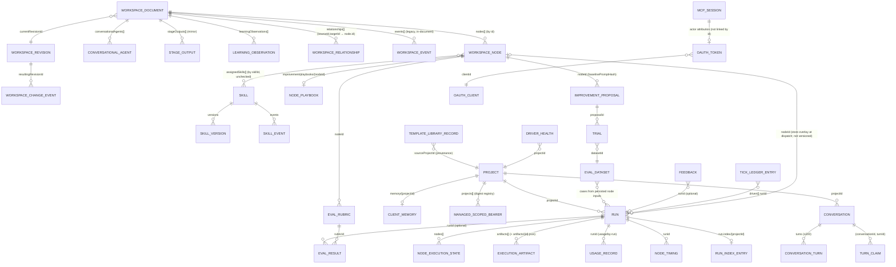

# CMS-Agent — Data Architecture

Status: current as of commit `40424c4` (2026-09-05), reconstructed from `src/agent/repository/**`, `src/agent/mcp/workspace/store.ts`, `src/agent/workspace/executionTypes.ts` and the storage adapters. Entity-level field reference with JSON examples: [reference/DATA_ENTITIES.md](reference/DATA_ENTITIES.md). Evidence classes as in [ARCHITECTURE.md](ARCHITECTURE.md).

## 1. Storage model in one paragraph

There is one durable store: a Google Cloud Storage bucket (`GCS_BUCKET`, production `cms-agent-503015-cms-agent-state`), addressed through the `BlobStoreClient` interface (`src/agent/repository/blobs/blobClient.ts`) by the `Blob*Repository` classes. The GCS transport (`repository/gcs/gcsStoreClient.ts`) implements the same `get/getWithMetadata/setJSON/list/delete` surface as `@netlify/blobs` and adds object-generation preconditions, so every conditional write (`onlyIfMatch` / `onlyIfNew`) is a real compare-and-swap. `WORKSPACE_STORE` selects the backend: `gcs` (production, every Cloud Run entrypoint), `blobs` (Netlify Blobs — LEGACY, migrated off in August 2026), `memory` and `json` (both in-process; `json` does **not** write a file — `JsonWorkspaceStore` in `store.ts:654` is dead code). Records are JSON documents; there is no database, no index service and no transaction across keys.

## 2. Authority matrix

"Canonical owner" is the subsystem whose write is the truth; everything else is a copy, cache or view. **Multiple writers** rows are architecture risks and are cross-referenced to [KNOWN_ISSUES.md](KNOWN_ISSUES.md).

| Domain | Canonical owner | Storage | Read path | Mutation path | Consumers | Notes |
|---|---|---|---|---|---|---|
| Project (tenant) definition | Project registry: code defaults (`projects/defaultProjects.ts` + per-project `definition.ts`) seeded into, then owned by, the project repository | `projects/{projectId}.json` | `ProjectRepository.get/list` (seeds + migrates defaults on read, `BlobProjectRepository.ensureSeeded`) | `project.create/update/delete` (`projects/projectAdmin.ts`), `site.duplicate` genesis, reconciler (`clientSiteBinding`, `tokenSecretRef`) | executor preflight, MCP adapter, publisher gates, conversational runner | **Multiple writers, no CAS** — `save()` is unconditional (K-P4). Defaults re-seed on next read if deleted (`project.delete` refuses defaults). |
| Project credentials | Deployment env (values) or Secret Manager (values); the record holds only NAMES/REFS | Cloud Run env / Secret Manager; `projects/*.json` carries `mcpEndpointEnvVar`, `tokenEnvVar`, `tokenSecretRef`, `mcpEndpoint` | `resolveProjectConnectionWithSecrets` (env first, record second; 5-min secret cache) | Deploy scripts, Secret Manager, genesis | MCP adapter, drivers | Endpoint URL may live on the record (not a secret); token value never does. |
| Tenant chat scoped bearers | Managed scoped-bearer registry (digest only) + Netlify site env (value) | `auth/managed-scoped-bearers.v1.json` (CAS, 8 attempts); token value on the tenant's Netlify site | `findAnyScopedBearerTokenPolicy` on every MCP request | genesis mint, reconciler `--apply`; legacy `MCP_SCOPED_TOKENS_JSON` env map | `mcpEndpoint.ts` auth | One document for the whole fleet — every rotation rewrites it. |
| Workspace state (nodes, agents, relationships) | Workspace document | `workspace/current.json` (single document, `schemaVersion: 1`, monotonic `workspaceVersion`, `currentRevisionId`) | `WorkspaceStateStore.load()` → tolerant parse (drops invalid nodes and heals) | `WorkspaceStateStore.mutate()` only: validate → bump version → snapshot revision (structural changes) → append event → CAS save → change sink | MCP `workspace.*`, `agent.*`, `skill.assign`, `changes.restore`, optimizer promote, `resolveConductorNodes` (store mode) | Canonical topology is CODE (`nodes.ts` etc.); the store may override only how a node runs (`overlayStoreNode`, `executor.ts:346-363`, metadata merged per key). |
| Stage outputs (workspace-scoped) | Workspace document | `workspace/current.json` → `stageOutputs[]` | `stage.get_output/list_outputs` | `stage.save_output`; executor mirrors each node output here after a durable run save (`prepared.commit`) | Nodes (via controlled `stage.*` tools), UI | **Derived copy** of `run.stageOutputs`; every save is a full-document CAS write (K-P2). |
| Workflow/run state | Execution repository | `runs/{runId}.json` (+ `run-index/{projectId}.json`, `run-index/!meta.json`) | `getRun`, `listRunsPage` (index-first windowing; unscoped+unlimited = full fleet fetch, 5 s in-process cache) | `createRun`, `saveRun` (CAS on `rev` + ETag), `resetRun` (unconditional, bumps rev) — all via `executor.ts` under `withRunLock` | drivers, MCP `workflow.*`, constellation, tick, publisher (re-reads run) | Single writer per revision by design; four drivers compete via CAS. |
| Content / article bodies | **Tenant site** (project MCP object) once published; before that, the run's `stageOutputs.article_body` (the `article_body.v1` envelope) | Tenant store; `runs/{runId}.json` | Tenant `object_get`; `workflow.get_run detail:"full"` | Tenant `object_patch/publish` via the project hook; CMS-Agent nodes | Publishing tail, readers | CMS-Agent never holds canonical published content ([PUBLISHING_ARCHITECTURE.md](PUBLISHING_ARCHITECTURE.md) §2). |
| Node outputs / stage outputs (run-scoped) | Run record | `runs/{runId}.json` → `nodes[].output`, `stageOutputs{}` | `getRun` | executor only | downstream nodes (dependency input), publisher, learning recorder | |
| Artifacts | Run record (`run.artifacts[]`) | `runs/{runId}.json` **and** `artifacts/{artifactId}.json` (written on every `saveRun`, deleted on `resetRun`) | `ArtifactRepository.listArtifacts(runId)` scans the whole `artifacts/` prefix; `node.list_outputs` | executor (`buildArtifact`) | UI, `node.*` output tools | **Dual write**, non-atomic with the run save (K-P3). Artifact *bytes* (images, PDFs) live in PDF-Tool / tenant storage; CMS-Agent stores only ArtifactReferences inside outputs. |
| Artifact references (media) | Producing system (PDF-Tool job / tenant media) | Inside node outputs (`artifact_plan`, `artifact_materializer`, `article_body.artifactReferences`) | Run record | executor deterministic routes (`artifactMaterialization.ts`) | publisher media gate (`unverified_media`, `raw_image_artifact_public_url`) | Refs are opaque strings; verification = presence in the run's verified set. |
| Publishing decision & receipts | Run record | `runs/{runId}.json` → `operatorPublishDecision`, `publishingPolicySnapshot`, `stageOutputs.publication_controller/publish_executor/release_executor`, `releaseLedger` | `resolvePublishAuthority`, `publishRun` gates | `workflow.set_operator_publish_decision` (only writer of the decision), executor routes, `releaseExecution.ts` (ledger) | drivers, UI attention feed | Policy is snapshotted at run creation and never re-read (ADR invariant 7). |
| Agent memory (client memory) | Client memory store | `memory/{projectId}.json` (unconditional read-modify-write — K-P4) | `client_memory.list_templates` controlled tool | `recordTemplates` from clone `report` stage (side effect only) | clone nodes | Per-tenant, never cross-tenant. |
| Template library | Template library store | `library/{templateId}/{version}.json` (immutable) + `library/{templateId}/latest.json` | `library.list_templates` | `library.publish_template` (content-hash versioning) | `library.instantiate_template` | Cross-tenant by design. |
| Learning observations | Workspace document | `workspace/current.json` → `learningObservations[]` (soft-delete via `status: "archived"`) | `learning.list_observations` (**on gcs/blobs backends reads the `learning/` prefix instead — defect C-1**) | `learning.record_observation` (nodes, publisher, termination observations), archive tools | curation (`playbook.migrate_observations`) | Observations are NOT injected into prompts; playbooks are. |
| Conversation-turn learning ledger | Learning repository | `learning/conversation-turn-gc/{project}/{conversation}.json` | GC planner | `recordConversationTurnSupersession/Reference` — **no caller in `src/` today** | GC job | Latent; shares the `learning/` prefix (C-1). |
| Playbooks (the thing that changes future runs) | Improvement repository | `improvement/playbooks/{nodeId}.json` | both runners on every dispatch (`renderPlaybookForPrompt`) | `playbook.apply_delta/curate/migrate_observations`, `optimizer.promote`/`auto_promote` (prompt, via workspace) | node prompts | Unconditional writes (K-P4). |
| Evaluation substrate | Evaluation repository | `evaluation/{rubrics,rubric-versions/<id>/,results,pairwise,feedback,regression}/*.json` (RecordEnvelope) | `evaluation.*`, `feedback.list`, optimizer analysis | `evaluation.*`, `feedback.record`, ingestion jobs, judge | optimizer, model ladder, fine-tune readiness | Append-only except rubric current record. |
| Proposals / trials / datasets | Improvement repository | `improvement/{proposals,trials,datasets}/*.json` | `optimizer.*`, `dataset.*` | same | promote path | |
| Run history / listing | Execution repository index | `run-index/{projectId}.json` (compact entries), `run-index/!meta.json` | `listRunsPage` | `upsertIndexEntry` on every run write (CAS ×4, then one unconditional write) | `workflow.list_runs`, tick (`listRuns({})` = full fleet) | Self-healing; may lose one concurrent entry until that run's next save. |
| Tool-execution ledger | Tool-execution repository | `tool_executions/by-run/{runId}/{toolExecutionId}.json`, `by-node/{nodeId}/{toolExecutionId}.json`, `project-index/{projectId}.json` + `project-index/!meta.v1.json` | `tool.list_executions`, project Access `usedBy` | immutable run/node copies plus CAS project-index upsert | tool audit, project Access | Project index is self-healing: its first project-scoped read of pre-index data scans all `by-run/` records and stamps the meta only after indexing every discoverable project record. Later project reads load one index and only the selected full records. Ordering is `startedAt`, then `toolExecutionId`; result limits select newest records but return them oldest-first. Run/node and cross-project queries retain their direct-prefix/full-scan coverage; their result limit is not a download bound. |
| Usage records | Usage repository | `usage/by-run/{runId}/{usageId}.json` (with runId) or `usage/{usageId}.json` | `summarizeModelUsage` (per-run prefix), `usage.*` | runners (actual), executor mock estimates, `usage.record`, conversational runner | budget gates, `workflow.get_run_cost`, ladder | Estimates only; pricing catalog is placeholder (`modelUsage.ts:21`). |
| Node timings | Node timing repository | `node_timings/by-workflow/{workflowId}/{timingId}.json` | `aggregateNodeTimingsByNode` | executor after each terminal node state | stall assessor (p95), `get_run_cost` | Unbounded. |
| Driver health / tick ledger | Driver health repository | `ticks/{tickId}.json` (48 h retention, pruned by the tick), `driverHealth/{projectId}.json` | `project.get/list`, stall block | tick, conductor job | operators | Best-effort telemetry. |
| Analytics / tracking data | **Tracking sink (kugel-data)** — outside CMS-Agent (external contract: shape and cadence assumed by `trackingIngestJob.ts`, unverified here) | sink DB | `feedback.ingest_tracking` pulls rollups | sink | learning substrate (feedback outcomes) | CMS-Agent stores only ingested outcomes in `evaluation/feedback`. |
| Change history | Change repository | `changes/{eventId}.json`, `revisions/{revisionId}.json` (RecordEnvelope `workspace_change_event.v1` / `workspace_revision.v1`, append-only) | `changes.*`, `getVersions` | `WorkspaceStateStore.mutate` change sink (after the document save) | UI History, restore | A crash between document save and sink write loses one history record (documented). The legacy in-document `events[]` list also grows with every mutation (K-P2); `versions[]` is a frozen legacy array that is read-merged by `getVersions()` and no longer written. |
| Conversations (admin chat mirror) | Conversation-turn repository — **Platform `ChatDoc` is the human-facing authority** | `conversations/{conversationId}.json` (bounded 200 turns + trim marker), `conversation-turn-claims/{conv}/{turn}.json` | `list`, `getClaim` | `record` (CAS), `claim/completeClaim/failClaim` | GC job, audit | Claims are never deleted (K-P5). |
| MCP sessions & OAuth state | MCP state store | `mcp/session/{id}`, `mcp/oauth/{client,code,token,refresh}/{hash}` (TTL envelopes; expiry enforced on read) | session manager, OAuth service | initialize/touch/terminate; register/authorize/token | endpoint | No sweeper: expired blobs persist until touched (K-P5). |
| Configuration | Deployment env + Secret Manager (see [DEPLOYMENT.md](DEPLOYMENT.md) §5) | Cloud Run revision | `process.env` | deploy scripts / console | everything | Some behaviour-defining config lives in the **store** instead (node metadata flags) — K-A1. |
| Prompts | Store node `prompt` (store mode, default) with canonical `nodes.ts` as seed/fallback; conversational agent prompts in `workspace/current.json.conversationalAgents` | `workspace/current.json` | `resolveConductorNodes`, `node.get_effective_prompt` (prompt + skills + playbook) | `workspace.update_node_prompt`, `optimizer.promote`, `agent.update`, canonical-upgrade seeding (`ensureConversationalAgentSeeds`) | runners | Canonical literals are locked by `npm run nodes:check`; `npm run store:update` pushes canonical into the store. |
| Schemas | Node `inputSchema`/`outputSchema` (store overlay over canonical); **client object contracts are canonical on the tenant** (`object_contract`, cached reduced in `workspace/current.json.reducedContractCache`) | `workspace/current.json`; tenant | `node.get_*_schema`, `contractPrefetch.ts` | `workspace.update_node_*_schema` | runners (`outputType` json_schema), `validateOutput`, publisher (canonical article_body schema only — K-A3) | |

## 3. Storage key conventions (GCS object names, optional `GCS_KEY_PREFIX` in front)

| Key pattern | Entity | Writer | Concurrency |
|---|---|---|---|
| `workspace/current.json` | WorkspaceDocument | `BlobWorkspaceRepository.save` | ETag CAS (`onlyIfMatch`), create-only seed (`onlyIfNew`), plus `expectedWorkspaceVersion` / `baseRevisionId` checks |
| `runs/{runId}.json` | WorkflowExecutionRecord | `BlobExecutionRepository` | `rev` check + ETag CAS; `resetRun` unconditional |
| `run-index/{projectId}.json`, `run-index/!meta.json` | RunIndexBlob / RunIndexMeta | `BlobExecutionRepository` | CAS ×4 then one unconditional write |
| `artifacts/{artifactId}.json` | `{ runId, artifact }` | `BlobExecutionRepository.persistArtifacts` | unconditional overwrite |
| `projects/{projectId}.json` | ProjectConnectionConfig | `BlobProjectRepository` | unconditional |
| `skills/current/{skillId}.json`, `skills/versions/{skillId}/{versionId}.json`, `skills/events/{eventId}.json` | SkillDefinition / snapshot / event | `BlobSkillRepository.save` (rewrites **all** current+versions+events, deletes removed) | none |
| `changes/{eventId}.json`, `revisions/{revisionId}.json` | RecordEnvelope<WorkspaceChangeEvent / WorkspaceRevision> | `BlobChangeRepository.record` | append-only |
| `usage/{usageId}.json`, `usage/by-run/{runId}/{usageId}.json` | ModelUsageRecord | `BlobUsageRepository` | append-only |
| `tool_executions/by-run/{runId}/{toolExecutionId}.json`, `tool_executions/by-node/{nodeId}/{toolExecutionId}.json` | ToolExecutionRecord | `BlobToolExecutionRepository.record` | immutable copies, written concurrently; a tenant call outside a run uses `(no-run)` / `(no-node)` rather than being omitted |
| `tool_executions/project-index/{projectId}.json`, `tool_executions/project-index/!meta.v1.json` | compact ToolExecutionIndexEntry[] / backfill marker | `BlobToolExecutionRepository` | per-project CAS retry (four conditional attempts, then one merged best-effort write); absent meta triggers one complete legacy `by-run/` scan, never a limit-shaped partial scan |
| `node_timings/{timingId}.json`, `node_timings/by-workflow/{workflowId}/{timingId}.json` | NodeTimingRecord | `BlobNodeTimingRepository` | append-only |
| `ticks/{tickId}.json`, `driverHealth/{projectId}.json` | TickLedgerEntry / TenantDriverHealth | `BlobDriverHealthRepository` | unconditional; ticks pruned after 48 h |
| `evaluation/rubrics/{id}.json`, `evaluation/rubric-versions/{id}/{versionId}.json`, `evaluation/results/{evalId}.json`, `evaluation/pairwise/{id}.json`, `evaluation/feedback/{id}.json`, `evaluation/regression/{id}.json` | RecordEnvelope<…> | `BlobEvaluationRepository` | append-only / rubric current overwritten |
| `improvement/proposals/{id}.json`, `improvement/trials/{id}.json`, `improvement/datasets/{id}.json`, `improvement/playbooks/{nodeId}.json` | ImprovementProposal / TrialRecord / EvalDataset / NodePlaybook | `BlobImprovementRepository` | unconditional |
| `conversations/{conversationId}.json` | ConversationMirrorEntry[] (turns + trim marker + tombstones) | `BlobConversationTurnRepository.record/applySupersessionGc` | CAS ×5 |
| `conversation-turn-claims/{conversationId}/{turnId}.json` | ConversationTurnClaim | `claim/completeClaim/failClaim` | CAS; never deleted |
| `learning/conversation-turn-gc/{projectId}/{conversationId}.json` | ledger `{supersessions, references}` | `BlobLearningRepository.mutateLedger` | CAS ×5 |
| `memory/{projectId}.json` | MemoryEnvelope (client memory) | `clientMemoryStore` | unconditional (`clientMemoryStore.ts:56`) |
| `library/{templateId}/{version}.json`, `library/{templateId}/latest.json` | TemplateLibraryRecord | `templateLibraryStore.publish` | immutable versions + CAS on latest |
| `auth/managed-scoped-bearers.v1.json` | ManagedScopedBearerDocument | `ManagedScopedBearerCredentialRepository.mutate` | CAS ×8 |
| `mcp/session/{id}`, `mcp/oauth/client/{id}`, `mcp/oauth/code/{hash}`, `mcp/oauth/token/{hash}`, `mcp/oauth/refresh/{hash}` | TTL envelopes `{ value, expiresAt }` | `BlobStateStore` | unconditional |

Ids: `run_<epochMs>_<6 base36>` (`makeRunId`), `req_<epochMs>_<rand>` (auto join key — distinct from the operator publish id `req_<flow>_<topic>_<yyyymmdd>_<nn>`), `rev_…`, `evt_…`, `event_…`, `learning_…`, `stage_…` (`makeId(prefix)` = `${prefix}_${Date.now()}_${random6}` in `store.ts:114`), `mcps_<48 hex>` sessions, `agt_*` agents, `trial_` prefixed run ids for replay. Timestamps are ISO-8601 strings from `new Date().toISOString()`; ordering of runs uses `startedAt` then `runId` as tiebreak.

## 4. Entity relationship diagram

### Weak or implicit relationships that should become explicit references

| Relationship | Today | Risk | Recommendation |
|---|---|---|---|
| Run → node definition version | `NodeExecutionState.provenance.promptVersion` (hash) + `model`; no `revisionId` | Cannot reproduce which store revision a node ran with | Stamp `workspaceRevisionId` on dispatch |
| Run → published tenant object | `publishRequestId`, `stageOutputs.publish_executor.objectId` (nested, dialect-dependent) | Join from a tenant object back to a run requires reading receipts | Top-level `publishedObjects[]` on the run |
| Node.assignedSkills → skill | ids only, no existence check at assign time (`skill.assign` validates; `workspace.update_node` does not) | dangling skill ids | Validate in `mutate()` |
| Artifact → artifact bytes | ArtifactReference strings inside outputs, verified by set-membership | Orphaned bytes on PDF-Tool/tenant when a run resets | Reference registry per run |
| Conversation turn → learning ledger | `learning/conversation-turn-gc/*` keyed by ids only; no writer in `src/` | latent | Decide whether to ship or delete |
| Usage record → run | `runId` key path; records without `runId` are unindexed | per-project cost needs a full `usage/` scan | Project-level index |
| OAuth token → session | attribution only through `actor` | cannot revoke sessions per token | link ids |
| ExecutionArtifact ↔ `artifacts/{id}.json` | duplicated | drift after partial writes | keep one (run record) |

## 5. Concurrency strategy

- **Workspace document**: single JSON document, optimistic concurrency at three levels — store ETag/generation CAS (`BlobWorkspaceRepository.save`), `workspaceVersion` equality (`expectedWorkspaceVersion`), and revision chain (`baseRevisionId`). A stale reader under eventual consistency reloads up to 4× with backoff (`STALE_READ_RETRIES`, `store.ts:356`). Conflicts surface as `WorkspaceVersionConflictError` (`version_conflict` code) — callers reload and retry. TESTED (`workspaceVersionConsistency`, `gcsBackend`).
- **Runs**: per-process `withRunLock` promise chain per runId + durable CAS on `rev`; `advanceRun` retries up to `MAX_SAVE_RETRIES` on `RunConcurrencyError`, re-selecting the next node from fresh state so a completed node is never re-run. Dispatch claims (`dispatchedAt + timeoutMs + 90 s`) let a second driver reclaim a node whose driver died; the claim is re-stamped per phase for long article-body validation loops. TESTED (`workflowRunnerConcurrency`, `concurrentDispatch`, `deterministicStageDispatchClaim`, `runStallHeartbeat`).
- **Everything else**: CAS loops where the writer bothered (run index, conversations, turn claims, learning ledgers, managed bearers, template-library latest) and unconditional writes elsewhere (projects, playbooks, skills, artifacts, usage, client memory). See KNOWN_ISSUES K-P4.
- **Cross-key atomicity**: none. A run save, its artifact blobs and its index entry are three writes; the change event follows the document save. Every reader tolerates the partial states listed in §2.

## 6. Schema versioning and migration

| Entity | Version field | Migration mechanism |
|---|---|---|
| WorkspaceDocument | `schemaVersion: 1` (literal), `workspaceVersion` (monotonic counter, not a schema version) | Zod schema with `.default()`s for fields added later (`conversationalAgents`, `versions`, `events`, `relationships`, `reducedContractCache`); tolerant parse drops invalid nodes and writes the healed document back; `ensureWorkspaceNodeSeeds` / `ensureConversationalAgentSeeds` top up missing canonical nodes/agents and upgrade unchanged canonical prompts on read. No explicit schemaVersion bump has ever happened. |
| WorkflowExecutionRecord | none (`rev` is concurrency, not schema) | Optional fields with documented absent-means semantics (`publishingPolicySnapshot` absent ⇒ operator-gated; `operatorDecisionSource` absent ⇒ explicit; `rev` absent ⇒ 0). No test loads an old record (KNOWN_ISSUES T-6). |
| ProjectConnectionConfig | `definitionVersion` (per code default) | `migrateDefaultProjectConfig` rewrites default projects on read when the code definition advanced (`projects/defaultMigration.ts`); a health finding reports dialect drift. |
| RecordEnvelope entities (changes, revisions, evaluation) | `schema_version` string (`workspace_change_event.v1`, …) | none needed yet |
| Managed scoped bearers | `contract: managed_scoped_bearers.v1`, `revision` | parse refuses unknown shapes |
| Conversations | `recordType` discriminator | additive |
| Store transport | — | `migrate-store` job copies Netlify Blobs → GCS key-for-key (idempotent) and verifies; the runbook's cutover order is `docs/platform/PHASE2_RUNBOOK.md` (RUNBOOK-OBSOLETE, migration done) |
| Node literals ↔ store | — | `scripts/seedNodesFromWorkspace.ts` (store → canonical, `npm run nodes:update`), `scripts/reseedStoreFromCanonical.ts` (canonical → store, allowlisted fields, `npm run store:update`), `scripts/applyNodeOps.ts` (targeted ops) |

## 7. Deletion and retention

| Entity | Deleted by | Retention |
|---|---|---|
| Runs, run index, usage, node timings, evaluation, improvement, changes, revisions | **never** (no tool, no job) | unbounded — the tick's full-fleet `listRuns({})` and constellation metrics scale with it (K-P5) |
| Artifacts blobs | `resetRun` deletes the run's previous artifact blobs; otherwise never | unbounded |
| Learning observations | soft-delete only (`status: archived`) | forever inside `workspace/current.json` |
| Workspace `events[]` (in-document) | never | grows with every mutation (K-P2); `versions[]` is frozen legacy data |
| Conversations | trimmed to the last 200 turns per conversation with a trim marker; GC job tombstones superseded turns (dry-run by default) | bounded per conversation; conversations themselves never deleted |
| Turn claims | never | unbounded |
| Tick ledger | pruned by the tick after `TICK_LEDGER_RETENTION_MS` (48 h) | 48 h |
| MCP sessions, OAuth codes/tokens | lazily on read after expiry (30 min idle / 12 h max; code 5 min, access 1 h, refresh 30 d); registered clients never | expired blobs persist until touched |
| Projects | `project.delete` (non-default only) | — |
| Skills | `skill.delete` (versions/events retained) | — |
| Managed scoped bearers | replaced on rotation (reconciler) | previous digests dropped |

## 8. Do-not-assume notes for agents

- Do not assume `learning/{observationId}.json` exists — observations live in the workspace document (README used to say otherwise).
- Do not assume `WORKSPACE_STORE=json` persists anything.
- Do not assume `run.dryRun` or `workflow_start_dry_run` implies "no side effects".
- Do not assume a node's `dependsOn` in the store is what runs — topology is pinned to code at dispatch.
- Do not assume `artifacts/{id}.json` and `run.artifacts[]` agree after a crash; the run record wins.
- Do not read `run.requestId` as the publish id; `publishRequestId` is a different identifier authored by `artifact_plan` or the operator.
