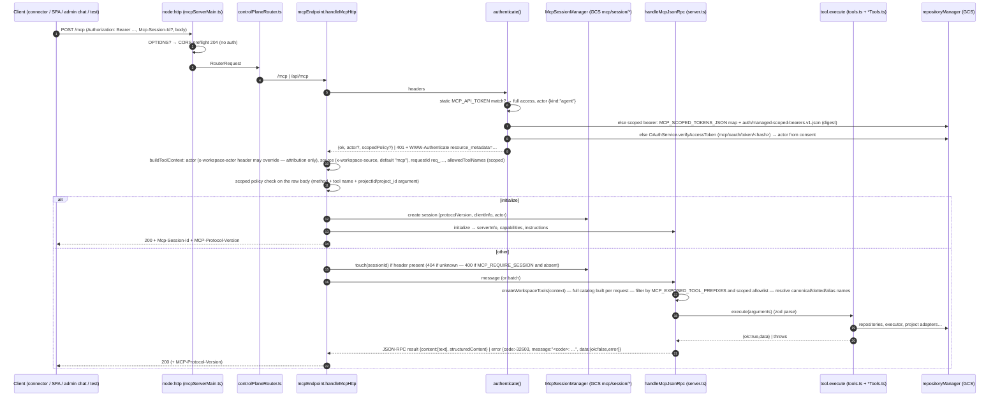

# CMS-Agent — MCP Architecture

Status: current as of commit `40424c4` (2026-09-05). Tool-by-tool reference: [reference/MCP_TOOLS.md](reference/MCP_TOOLS.md) (generated). Auth/credential detail also in [SECURITY.md](SECURITY.md). Evidence classes as in [ARCHITECTURE.md](ARCHITECTURE.md).

CMS-Agent is both an MCP **server** (the workspace control plane) and an MCP **client** (to tenant sites, PDF-Tool and Monetizer). This document covers the server; the client side is in [PUBLISHING_ARCHITECTURE.md](PUBLISHING_ARCHITECTURE.md) §4.

## 1. Transport

| Property | Value | Evidence |
|---|---|---|
| Protocol | MCP Streamable HTTP, JSON-RPC 2.0 over `POST`; **no server-initiated SSE** (`GET` → 405) | `src/agent/mcp/http/mcpEndpoint.ts:142-145` |
| Paths | `/mcp` (canonical) and `/api/mcp` (compat) on Cloud Run; `/api/mcp` on Netlify (legacy) | `controlPlaneRouter.ts:24,34`; `netlify.toml:41-42` |
| Protocol versions | `2025-06-18` (default), `2025-03-26`; negotiated on `initialize`, echoed in `MCP-Protocol-Version` | `mcp/transport/session.ts:18-24` |
| Sessions | `initialize` mints `Mcp-Session-Id: mcps_<48 hex>`; sliding idle TTL 30 min, absolute 12 h; `DELETE /mcp` terminates; unknown id → 404 so clients re-initialize; sessions optional unless `MCP_REQUIRE_SESSION=true` | `session.ts`, `mcpEndpoint.ts:150-177` |
| Session store | `mcp/session/*` in the same store as workspace data (GCS in production, so sessions are shared across Cloud Run instances — no affinity needed); Memory store in tests | `mcp/state/stateStore.ts:121-136` |
| Batching | JSON-RPC arrays accepted; calls run with `Promise.all`; notification-only batches → 202 | `mcpEndpoint.ts:186-192` |
| Body limit | 5 MiB (Cloud Run server) → 413 | `entrypoints/mcpServerMain.ts:11` |
| CORS | Cloud Run only; exact-origin allow-list `MCP_ALLOWED_ORIGINS` (unset = deny all); preflight answered before auth | `mcpServerMain.ts:14-49` |
| Methods | `initialize`, `notifications/initialized`, `ping`, `tools/list`, `tools/call`, `prompts/list` (node ids), `resources/list` + `resources/read` (`workspace://export` — the whole workspace document) | `mcp/workspace/server.ts:110-140` |
| Server identity | `publishing-workspace-mcp` v `0.1.0`; `instructions` carry the "content path notice" steering editors to the tenant admin chat | `server.ts:70-72,112` |

## 2. Request lifecycle

Error semantics: unknown tool → `-32602`; unknown method → `-32601`; tool failure → `-32603` with `message` starting with the machine code and the structured envelope in `data` (`toolKit.toolError/toolErrorSummary`); zod failures → `validation_error` with issues; typed project/converse errors carry `code`, `providerStatus`, `providerMessage`, `operatorAction`. HTTP-level: 401 (auth), 400 (`missing_session`, `invalid_json`), 404 (`session_not_found`), 405, 413, 500 (`internal_error`, message = error text). Successful tool results are always wrapped `{ ok: true, data }`.

## 3. Authentication and authorization

| Credential | Who uses it | Authority | Attribution | Source of truth |
|---|---|---|---|---|
| Static bearer `MCP_API_TOKEN` | Operator, SPAs (pasted), scripts, LibreChat | **Every** exposed tool, prompts, resources | `actor {kind:"agent"}` unless `x-workspace-actor` header self-describes | Secret Manager `mcp-api-token` |
| OAuth 2.1 access token (`mcp/oauth/token/*`) | Claude/ChatGPT connectors | Every exposed tool (no scopes beyond the single `MCP_SCOPE`) | actor recorded at consent | issued by `OAuthService` after a human enters `MCP_OAUTH_APPROVAL_SECRET` (falls back to `MCP_API_TOKEN`) on `/oauth/authorize`; PKCE S256; DCR at `/oauth/register`; refresh rotation |
| Scoped bearer — static map `MCP_SCOPED_TOKENS_JSON` | break-glass tenant credentials | only `toolAllowlist` (wire names) and only for `projects[]`; `initialize`/`ping`/`tools/list` allowed; prompts/resources denied | agent | Secret Manager `mcp-scoped-tokens-json`; superseded per project once a managed credential exists |
| Scoped bearer — managed registry | tenant admin chats (Client Manager), minted by genesis / reconciler | as above; allowlist = `SITE_CLIENT_MANAGER_TOOLS` (locked by `docs/site-credential-scope-lock.json`) | agent | `auth/managed-scoped-bearers.v1.json` (sha-256 digests only); the token value lives on the tenant's Netlify site |
| Netlify Identity (`ADMIN_EMAIL_IDS`) | ui login gate only | none over MCP | — | Netlify |
| Broker session (IAP JWT / password cookie) | workbench via workbench-broker (if deployed) | broker policy: 40 read verbs, 44 mutating verbs, `READ_ONLY=1` default | — | broker |

Authorization inside CMS-Agent is therefore **per bearer, not per tool**: a full bearer can call `workflow_publish_run`, `project_call_tool` (with Dr. Lurie's and Platform's `defaultToolPolicy: "allowed"` this reaches `object_publish` and `release_to_production` with no publish gate), `site_duplicate` and `workspace_delete_node`. A tenant's scoped chat bearer is pinned to its project only for calls that carry `projectId`/`project_id` (`mcpEndpoint.ts:121-122`, `project === undefined` passes); run-addressed tools in its allowlist (`workflow_get_run`, `workflow_run_all`, `workflow_set_operator_publish_decision`, `workflow_publish_run` without `projectId`) act on any run by `runId` — KNOWN_ISSUES K-M9, reproduced by `scripts/repro/knownIssues.ts`. The only finer controls are project tool policies (`allowed` / `needs_approval` / `blocked`, `projectTypes.effectiveToolPermission`), the publish gates, and catalog scoping. See [SECURITY.md](SECURITY.md) §3 for the consequences.

## 4. Catalog and namespaces

151 tools in 24 "namespaces" (segment before the first `.` of the internal name). `tools/list` advertises **canonical underscore names** (`workspace_get_nodes`) because remote connectors forward names into `^[a-zA-Z0-9_-]{1,64}$`-constrained APIs; `tools/call` also accepts the dotted internal spelling and three deprecated aliases (`node.list`, `node.get_execution`, `workspace.update_node_schema`). The surface is locked by `docs/mcp-tool-manifest.json` (CI `npm run test:drift`, both the Netlify adapter and the Cloud Run router are driven in-process and must match).

| Namespace | Count | Purpose |
|---|---|---|
| `workspace` | 23 | node/graph/relationship authoring, export/import |
| `workflow` | 18 | run lifecycle, drivers, publish decision, publish_run |
| `node` | 15 | per-node inspection, validation, standalone execution |
| `skill` | 13 | skill CRUD, versions, assignment |
| `project` | 11 | tenant registry, connection tests, tool passthrough |
| `evaluation` | 11 | rubrics, judge results, regression |
| `dataset` 6 · `optimizer` 6 · `tool` 6 · `agent` 5 · `constellation` 5 · `changes` 4 · `feedback` 4 · `learning` 4 · `playbook` 4 · `usage` 4 · `stage` 3 · `publish` 2 · `site` 2 · `repository` 1 · `visual_identity` 1 | | |
| `site_credentials_plan` / `site_credentials_apply` / `site_credentials_execution_status` | 1 each | **internal names have no dot**, so their "namespace" is the whole name: `MCP_EXPOSED_TOOL_PREFIXES=site` exposes `site_duplicate*` but not these (KNOWN_ISSUES K-M2) |

Scoping: `MCP_EXPOSED_TOOL_PREFIXES` (comma-separated namespaces) trims both listing and callability; scoped bearers trim further by explicit wire names. Unset exposes everything.

Cost of the full catalog: ~124 KB of JSON (names + descriptions + input schemas) per `tools/list`, i.e. roughly 30–35k tokens of connector context — the primary reason the content path is routed to the tenant admin chat with an 11-tool scoped credential rather than to this surface (K-M1).

Consumers of the surface today: the two SPAs (dotted names), Claude/ChatGPT connectors (canonical names, OAuth), the platform admin chat (`agent_resolve`, `agent_converse`, `workflow_*` subset via scoped bearer), `scripts/verifyDeployment.ts`, the drift detector, LibreChat (experimental).

## 5. Schema ↔ TypeScript alignment

Each tool declares both a zod schema (parses the input) and a hand-written JSON Schema (advertised). They are maintained side by side in `tools.ts` / `*Tools.ts` and locked by `tests/agent/mcp/*ToolSchemas.test.ts` for the node, project and run tools plus `tests/agent/tools/toolJsonSchema.test.ts` for controlled tools; there is no generic zod→JSON-Schema generation, so a new tool can drift silently unless a test pins it (KNOWN_ISSUES K-M3). Tool **output** schemas are not declared on the wire; the TypeScript return types are the only contract. `agent_converse` is the exception: request and response are strict zod (`conversationContract.ts`) and frozen by `CLIENT-MANAGER-CONTRACT.md` (not machine-diffed — T-9).

## 6. Legacy and compatibility

- `netlify/functions/mcp.mts` + `netlifyMcpAdapter.ts`: same core, Netlify Blobs state; still deployed and routed (`/api/mcp`); **re-verified 502 on 2026-09-06** (the Aug-2026 `ERR_REQUIRE_ESM` diagnosis in `netlifyMcpAdapter.ts:3-21` predates the 2026-08-27 deletion of the sibling `workspace-mcp` proxy, so the current cause is not re-diagnosed). Kept for the in-process drift detector and tests. Do not route new clients there.
- `netlify/functions/oauth-*.mts`: OAuth flow on Netlify, same `oauthEndpoints.ts` core — LEGACY but **live** (`/.well-known/oauth-authorization-server` returned 200 on 2026-09-06 with issuer `https://cms-agent.netlify.app`). Tokens it mints are stored in Netlify Blobs (`stateStore.ts:120-135`, `blobClient.ts:24-33`); the Cloud Run endpoint verifies against GCS, so they authenticate nothing that runs — a decoy surface, not a bypass. Approval on either plane needs `MCP_OAUTH_APPROVAL_SECRET` (fallback `MCP_API_TOKEN`, `auth/consent.ts:15-19`), so an OAuth token is full-bearer authority minted by someone holding the static secret.
- The `instructions` string still says "Session-aware Netlify Streamable-HTTP MCP endpoint" on Cloud Run (cosmetic, C-6).
- `MCP_STATE_STORE=blobs` on Cloud Run means "durable via the registered GCS transport", not Netlify Blobs.

## 7. Do-not-assume notes

- Do not assume a scoped bearer can list prompts/resources — only `initialize`, `notifications/initialized`, `ping`, `tools/list`, `tools/call`.
- Do not assume the `x-workspace-actor` header is authenticated; it is attribution and any bearer holder can set it.
- Do not assume sessions are required; most callers are stateless bearer callers.
- Do not assume `tools/list` is cheap or small.
- Do not assume tool names are stable across the dot/underscore boundary in logs: change history records the dotted internal name via `source`/`correlation`, the wire uses underscores.
