# CMS-Agent — Publishing Architecture

Status: current as of commit `40424c4` (2026-09-05). Traces a publish from workflow intent to the tenant site and states exactly where CMS-Agent's responsibility ends. Evidence classes as in [ARCHITECTURE.md](ARCHITECTURE.md). Policy background: `docs/plan/ADR-2026-08-25-publish-autonomy.md` (CURRENT-REFERENCE).

## 1. Responsibility boundary (MUST)

| Concern | CMS-Agent (this repo) | Tenant project MCP (`vreich-ui/platform`, one `/mcp` per site) |
|---|---|---|
| Deciding *whether* to publish | Yes — five gates in `publisher.ts` + publish-risk dispatch gate in `executor.ts` | Its own `object_validate`, locks, review policy, membership |
| Building the object | Yes — `article_body.v1` envelope → client object (`publishPayload.ts`, `objectDialect.ts`) | Validates and stores it |
| **Canonical content** | Never. Once `object_publish` succeeds the tenant object is the truth; the run keeps receipts | **Yes** — `object_get`/`object_list` are the source of truth |
| Media/artifacts (images, PDFs) | Plans and materializes through PDF-Tool / tenant tools, keeps ArtifactReferences, verifies refs before publish | Stores bytes and serves public paths |
| Going live (production release) | `release_executor` calls `release_to_production` + polls `deploy_status` (at most once per run/request key) | Executes the build hook and reports deploy state |
| Credentials for the tenant | Resolves `<CLIENT>_MCP_TOKEN` from env or `tokenSecretRef` from Secret Manager at call time; never persisted | Issues/holds them |
| Human approval UX | `operatorPublishDecision` on the run (MCP tool) | Admin chat approval, editor record (Platform `ChatDoc`) |
| Learning | Records observations/feedback about the publish | — |

"Where content becomes canonical": at the tenant's `object_publish` (or, for objects that pre-exist, `object_patch`). CMS-Agent's run record is an audit trail, not a content store.

## 2. End-to-end trace (article path, `publishing_conductor`)

```mermaid
sequenceDiagram
  autonumber
  participant Op as Operator / admin chat
  participant MCP as CMS-Agent MCP (workflow_*)
  participant EX as executor.ts (routes)
  participant RUN as Run record (GCS)
  participant PUB as publisher.ts publishRun
  participant HK as projects/<tenant>/hooks.executePublish
  participant AD as ProjectMcpAdapter (JSON-RPC client)
  participant T as Tenant MCP (platform)
  participant REL as releaseExecution.ts

  Op->>MCP: workflow_start_dry_run {projectId, input, publishRequestId?}
  MCP->>RUN: createRun (publishingPolicySnapshot: autonomyMode, publishEnabled, publishableTypes)
  Note over EX: … upstream nodes: triage → research → draft → reviews → contract_intelligence (client object_contract) → artifact_plan/materializer (PDF-Tool jobs, tenant media) → article_body (client object_validate loop) …
  EX->>EX: publish_payload (deterministic: build dry_run_publish_payload.v1, one read-only object_validate)
  EX->>EX: publication_controller (deterministic only if store metadata sets publicationControllerDeterministic — else model turn) → publication_decision.v1 {decision:"go"|…}
  EX->>EX: publish_executor is riskLevel "publish": dispatch only if resolvePublishAuthority(run).authorized
  alt not authorized
    EX->>RUN: node blocked, approvalsRequired[{gateId}], run blocked
    Op->>MCP: workflow_set_operator_publish_decision {approved}
    Op->>MCP: any advance → gate-blocked node requeued automatically
  end
  alt store metadata publishExecutorDeterministic = "execute"
    EX->>PUB: runEnginePublishExecution → publishRun({runId, requestId: runContext.requestId, live:true})
  else "gate"
    EX->>EX: deterministic refusal receipt only (never publishes)
  else absent (canonical default)
    EX->>EX: MODEL turn with project.call_tool granted (agent performs the calls itself — publishRun gates NOT applied)
  end
  PUB->>RUN: getRun — evaluate gates: operator_enabled, publish_authorized, explicit_live, operator_not_withheld, controller_decision_go
  PUB->>PUB: mock run? invalid request id? article_body schema? raw artifact keys? unverified media? readiness hook (no_go → blocked_for_publish_execution)
  PUB->>HK: executePublish(ctx) — dialect for dr-lurie / platform only
  HK->>AD: object_create (or adopt existing shell) → object_checkout → object_validate → object_patch → object_publish → object_checkin
  AD->>T: JSON-RPC tools/call with Bearer <tenant token>
  T-->>AD: results (lock_token, record_version, validation, publish receipt)
  HK-->>PUB: {result, objectId, clientValidation}
  PUB->>RUN: learning observation publish_executed / publish_failed
  PUB-->>EX: PublishResult (live | dry_run | blocked | error)
  EX->>RUN: publish_execution.v1 (status executed→ downgraded to blocked unless deployStatus evidence — publishCommitted:true)
  EX->>REL: release_executor (deterministic, idempotent per runId:requestId)
  REL->>T: release_to_production {idempotency_key} then deploy_status (one poll per dispatch)
  REL->>RUN: releaseLedger[runId:requestId] = pending | terminal
  EX->>EX: learning_recorder → observations
  EX-->>Op: run completed (receipts in stageOutputs.publish_executor / release_executor)
```

Files: `src/agent/workspace/{publishPayload,publicationController,publishDecision,publisher,publishExecution,releaseExecution,learningRecord,contentItemShell,artifactMaterialization}.ts`, `src/agent/projects/{projectHooks,objectDialect,clientToolResult,projectMcpAdapter,mcpClient,secretManager}.ts`, `src/agent/projects/{drLurie,platform}/hooks.ts`.

### 2.1 Where each fact is decided

| Fact | Decided by | Persisted where |
|---|---|---|
| Publish authority | `resolvePublishAuthority(run)`: `operatorPublishDecision === "approved"` (source `operator_explicit`) else `publishingPolicySnapshot.autonomyMode === "autonomous"` (source `policy_autonomous`); `withheld` always blocks | run |
| Operator enable / kill switch | `isProjectPublishEnabled`: env `<PREFIX>_PUBLISH_ENABLED` (`false` forces off, `true` forces on) else `publishingPolicy.publishEnabled` (server-forced **true** for every project since go-live 2026-07-31, `projectAdmin.ts:221`) — live read, never snapshotted | env + project record |
| Autonomy mode | `publishingPolicy.autonomyMode` on the project record; **no code default sets it**, absent ⇒ `operator-gated`, so a tenant publishes autonomously only if `project_update {autonomyMode:"autonomous"}` was applied (live registry fact, UNKNOWN from the repo) | project record → run snapshot |
| Controller decision | `readPublicationDecision` requires an explicit `decision: "go"` whose body fingerprint matches the current article body | `stageOutputs.publication_controller` |
| Publish request id | operator (`workflow_start_dry_run.publishRequestId`) or `artifact_plan` output, or conductor-minted when `artifact_plan` skips on `no_media_slots`; validated against `objectDialect.requestIdPattern` | run `publishRequestId` / stage output |
| Object identity | `objectDialect.objectIdSource` (`server_minted` or `request_id`), `siteObjectId`, `taxonomyRegistryObjectId`; `contentItemShell` may pre-create the object before `artifact_plan` | project record + stage outputs |
| Publishable object types | `publishableTypeCharter.ts` per workflow, snapshotted at run creation; `assertRecipeAuthorshipAllowed` refuses out-of-charter verbs | run snapshot |
| Media verification | union of envelope `artifactReferences`, `artifact_plan` verified set, caller `verifiedMediaRefs` | run |

## 3. Which publish path a run actually takes (K-A1 — read this before assuming)

`publish_executor`'s behaviour is a **store metadata flag**, not code:

| `metadata.publishExecutorDeterministic` on the store row | Behaviour |
|---|---|
| `"execute"` | Engine performs the publish via `publishRun` (all five gates, no model turn); outcome terminates the node either way |
| `true` ("gate") | Engine emits the refusal receipt when gates fail; when gates pass, falls through to the model path |
| absent (the **canonical** literal in `nodes.ts` sets none) | Model turn with `project.call_tool` granted: the agent itself calls tenant tools; `publishRun`'s gates are **not** consulted on this path (the executor's publish-risk dispatch gate still is) |

In this repository the flag is set only by `scripts/reseedStoreFromCanonical.ts --set-publish-executor-mode <gate|execute>` against the live store; any `workspace_update_node_metadata` / `workspace_update_node` / `workspace_import_workspace` caller can also set or drop it. It only applies when `WORKSPACE_NODES_SOURCE` is `store` (the default). The repository therefore cannot tell which mode production runs in — **UNKNOWN**; verify with `workspace_get_node {"id":"publish_executor"}` → `metadata`. The same applies to `publicationControllerDeterministic`. `release_executor`, `publish_payload`, `placement_resolver`, `contract_intelligence` and `artifact_materializer` are deterministic in canonical code.

For `capture_conductor` and `clone_conductor` the tail nodes carry workflow-owned routes (`captureStageDeterministic` / `cloneStageDeterministic`) that outrank the DTC flags; their publish executor uses `objectPublishExecution.ts` (`object_checkout → object_publish → object_checkin` per created/reused object, quarantined objects never published, leases released in `finally`).

## 4. Project MCP client side

`ProjectMcpAdapter` (`projects/projectMcpAdapter.ts`) wraps a minimal Streamable-HTTP JSON-RPC client (`mcpClient.ts`: `initialize`, `tools/list`, `tools/call`, `resources/list`, bearer header, abort signal, auth-failure classification). Per call: project `status` must be `active`; endpoint = env `<CLIENT>_MCP_ENDPOINT` else record `mcpEndpoint`; token = env `<CLIENT>_MCP_TOKEN` else Secret Manager `tokenSecretRef` (5-min cache, plane identity via metadata server); permission = `toolPolicies[tool]` > `allowedTools` > `defaultToolPolicy` > `blocked`; `needs_approval` returns `requiresApproval: true` without forwarding. `callReadTool` restricts to `READ_TOOL_ALLOWLIST` (15 read verbs). Per-project **executable policy** hooks (`drLurie/executablePolicy.ts`, `enforceCallToolPolicy`) can block specific calls (e.g., raw image URLs) — they are applied by the MCP tools `project_call_tool`/`project_call_read_tool`, by the controlled `project.call_read_tool`, and by the deterministic modules, but **not** by `ProjectMcpAdapter.callTool` itself and not by the node-facing controlled `project.call_tool` (`tools/toolRegistry.ts:176`), so a model node is bounded only by the project's permission model. Client refusals (`isError` results) are surfaced as `ClientToolRefusalError` with the client's own message (`clientToolResult.ts`).

Registered projects today (code defaults, seeded into `projects/*.json`): `dr-lurie` (full access, `wipe_blob_stores` needs approval), `platform`, `fernwell`, `pdf-tool` (read allowlist), `monetizer` (read allowlist), plus `project-a` (sample) and genesis-minted tenants. `snoocle` is listed in `.env.example`/README but has no definition (D-2).

## 5. Dr. Lurie boundaries (specific)

- Hook: `projects/drLurie/hooks.ts` — sequence `object_create → object_checkout → object_validate → object_patch → object_publish → object_checkin`; `objectIdSource: "request_id"` passes `requested_id`; taxonomy hints from `taxonomyRegistryObjectId`.
- Artifact policy: `drLurie/artifactPolicy.ts` refuses raw `image/…` artifact keys in rendered fields; PDFs may route via `/pdf/*`, images have no `/image/*` fallback (README's 2026 constraints still hold and are enforced in code).
- Readiness: `drLurie/publishReadiness.ts` checklist (`media_artifacts_verified` etc.) drives `publication_controller`'s deterministic decision and `workflow_publish_readiness`.
- Knowledge + editorial voice fallback: `drLurie/{knowledge,editorialVoice}.ts` injected into `client_manager` prompts (`conversationalRunner.assembleConversationPrompt`).
- The tenant-side policy document `docs/projects/dr-lurie-agent-publishing-policy.md` is the platform's contract; its §8.2 (`approved:true` as authority) is stale relative to this repo.

## 6. Artifact references

`ArtifactReference`s (opaque `artifact_ref` / slot ids from PDF-Tool or tenant media tools) travel inside node outputs: `artifact_plan.v1` (slots + verified set), `artifact_materializer` (adopt-or-create jobs, polled, never a wait loop inside one call), `article_body.artifactReferences`, then `publish_payload`. The publisher refuses `raw_image_artifact_public_url` and `unverified_media`. Binary bytes never pass through CMS-Agent (PDF-Tool's own rule) — CMS-Agent stores references only, and a run reset deletes the run's artifact blobs but never the bytes on PDF-Tool/tenant storage (orphan risk K-P3).

## 7. Success / failure return path

`publishRun` returns a discriminated `PublishResult` (`live` / `dry_run` with gate reasons / `blocked_for_publish_execution` with a resumable descriptor / `error` with `objectId` when the sequence created one). The executor writes it as `publish_execution.v1` into `stageOutputs.publish_executor` and the node's artifact; a claimed `executed` without deploy evidence is downgraded to `blocked` with `publishCommitted: true` and a `go_live_unconfirmed` blocker (`publishExecution.ts:33-45`), which `release_executor` then resolves. Observations `publish_executed` / `publish_failed` land in the workspace document. `workflow_get_run` (compact) exposes `publishRequestId`, `operatorPublishDecision`, `approvalsRequired` and per-node status; `detail:"full"` exposes the receipts.

## 8. Implemented vs planned

| Item | State |
|---|---|
| Article publish for dr-lurie and platform via hooks | IMPLEMENTED · TESTED (fakes) |
| Article publish for fernwell / zilberman / minted tenants | NOT IMPLEMENTED (`no_publish_executor`) — K-A2 |
| Clone/capture object publish via `objectPublishExecution` | IMPLEMENTED · TESTED (mock runs) |
| Release to production with idempotency ledger | IMPLEMENTED · TESTED (pure function only, T-3) |
| Autonomous publishing (`autonomyMode: "autonomous"`) | IMPLEMENTED in gates; which tenants are autonomous is a project-record fact (UNKNOWN from repo) |
| Manual approval mode per gate id | gate ids exist (`gateRegistry.ts`); per-gate hold UI/flow ASPIRATIONAL |
| Per-tool tenant policy `auto / manual / block` | IMPLEMENTED as `allowed / needs_approval / blocked` on project records; `needs_approval` has no approval *flow* (call is simply not forwarded) |
| Publishing plugin (ChatGPT/Claude agents publishing over tenant `/mcp`) | outside this repo |
| Genesis conductor (agentic onboarding) | ASPIRATIONAL |
