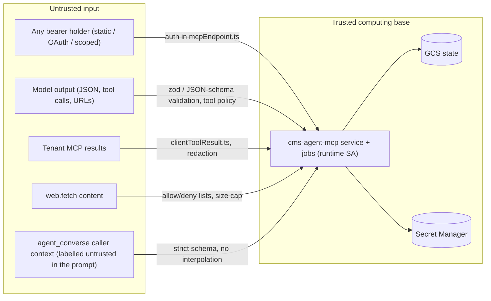

# CMS-Agent — Security

Status: current as of commit `40424c4` (2026-09-05). Trust boundaries, credentials, authorization and dangerous operations, from code. Evidence classes as in [ARCHITECTURE.md](ARCHITECTURE.md). Findings are cross-referenced to [KNOWN_ISSUES.md](KNOWN_ISSUES.md).

## 1. Trust boundaries

## 2. Credentials and where their values live (MUST)

| Credential | Value lives in | Referenced in code/records as | Rotation |
|---|---|---|---|
| `MCP_API_TOKEN` | Secret Manager `mcp-api-token` → Cloud Run env | name only | redeploy; also breaks every SPA operator paste |
| OAuth client/code/token/refresh | GCS `mcp/oauth/*` (hashed keys, TTL envelopes) | — | access 1 h, refresh 30 d with rotation, code 5 min; clients never expire |
| `MCP_SCOPED_TOKENS_JSON` | Secret Manager | token = map key (raw) | edit secret + redeploy; superseded per project by managed credentials |
| Managed scoped bearers | value on the tenant Netlify site (`CMS_AGENT_*` env); **sha-256 digest** in `auth/managed-scoped-bearers.v1.json` | digest | reconciler re-mint (daily scheduler) |
| Tenant MCP tokens (`<CLIENT>_MCP_TOKEN`) | Cloud Run env (secret binding) or Secret Manager version named by `tokenSecretRef` | env var NAME or resource NAME on the project record | Secret Manager version; 5-min in-process cache |
| `OPENAI_API_KEY`, `ANTHROPIC_API_KEY`, `GEMINI_API_KEY` | Cloud Run env (secret) | `modelConfig.apiKeyEnv` NAME | redeploy |
| `NETLIFY_API_TOKEN` | Secret Manager | name | — |
| Netlify Blobs credentials | Netlify runtime context (legacy) | — | — |
| Plane identity for Secret Manager | GCE metadata server token (`secretManager.ts:planeAccessToken`) | — | automatic |

Enforcement points: `redactSensitiveKeys` (`observability/redaction.ts`, keys matching `secret|token|api[_-]?key|authorization|password|cookie`) is applied to change events, revisions and publish results; the runner redacts `Bearer …` and forbidden keys in prompts; `ScopedBearerConfigurationError` never echoes parser detail; `secretManager.ts` errors are about reachability/permission only; `project.*` views expose `endpointConfigured`/`tokenConfigured` booleans and names, never values; the tick/job log project env var **names** at start (`driverEnvPreflight.logProjectEnvNamesOnce`).

## 3. Authorization model and its gaps

| Layer | Control | Gap |
|---|---|---|
| MCP bearer | static / OAuth = full catalog; scoped = tool allowlist + a project pin that applies **only to calls carrying `projectId`/`project_id`** (`mcpEndpoint.ts:121-122`) | No per-tool RBAC for full bearers; OAuth has one scope and its approval secret falls back to `MCP_API_TOKEN` (`auth/consent.ts:15-19`); `x-workspace-actor` (header or body `actor`) is self-asserted for every bearer and overrides even the OAuth token's actor (K-M4, reproduced); run-addressed tools in a tenant's scoped allowlist act on any run by `runId` (K-M9, reproduced) |
| Catalog exposure | `MCP_EXPOSED_TOOL_PREFIXES` | not set on the service by any deploy artifact |
| Project tool policy | `toolPolicies` > `allowedTools` > `defaultToolPolicy` > blocked; `needs_approval` = not forwarded | `project_update` can flip any policy with no version check; Dr. Lurie is full-access by definition; no approval *flow* exists |
| Publish gates | five closed gates + publish-risk dispatch gate + operator veto; policy snapshot per run | cover the run-based paths only; when `publish_executor` runs the **model path** (canonical default) `publishRun`'s gates are not consulted (K-A1); `project_call_tool` (full bearer) and model turns in non-publish-risk nodes holding `project.call_tool` (`article_body` and any tail node whose deterministic flag is off) reach tenant verbs with no gate (K-A10); "operator" = any full bearer or any tenant scoped chat bearer (PUBLISHING_ARCHITECTURE §2.0) |
| Node tool grants | `allowedTools` + skill tool policy + risk; canonical publish nodes carry `project.call_tool` by design; `reseedStoreFromCanonical` refuses to add that grant via re-seed | any full bearer can change grants through `workspace_update_node_tools` with only change history as a guard (K-M5); on the model publish path the executable policy hook is not applied (`toolRegistry.ts:176`) |
| Workspace deletion | canonical nodes need `adminApproved` + `allowCanonicalNodeRemoval` | any full bearer may pass both flags |
| Genesis / fleet | `site_duplicate` (live mode) creates Netlify sites, installs secrets, mints credentials; `site_credentials_apply` fires a Cloud Run job | callable by any full bearer; `SITE_GENESIS_NETLIFY_MODE` defaults to dry-run |
| UI login | Netlify Identity + `ADMIN_EMAIL_IDS` gates rendering only; the bearer the operator pastes is the real credential (localStorage in dev, sessionStorage in workbench) | browser holds a full-authority bearer (the broker exists to end this) |
| Broker | IAP JWT (ES256, audience pin) or password + HMAC cookie; default-deny verb policy; `READ_ONLY=1` | deployment unconfirmed |

## 4. Dangerous operations (operator-only)

| Operation | Why dangerous | Guard |
|---|---|---|
| `workflow_publish_run` / autonomous tail | writes a live tenant object; irreversible on the tenant side | gates; `<PREFIX>_PUBLISH_ENABLED=false` kill switch; `operatorPublishDecision: withheld` |
| `release_executor` / `release_to_production` | triggers a production build | idempotency ledger; in engine code only the releaser node speaks the verb — `project_call_tool` and model turns holding `project.call_tool` can also say it, bounded only by the tenant's tool policy (external contract) |
| `project_call_tool` on a full-access project | reaches publish/deploy/commerce/member tools on the tenant with **no publish gate**; on `dr-lurie` `wipe_blob_stores` is the only default `needs_approval`, on `platform` seven verbs are (`object_retire`, `object_review_decide`, `site_apply_theme`, `site_apply_brand_imagery`, `object_instantiate_template`, `object_instantiate_section_template`, `wipe_blob_stores` — `platform/definition.ts:64-80`); `needs_approval` is a refusal, no approval flow exists | project policies; full-bearer possession |
| `site_duplicate` (live) | Netlify site creation, env writes, deploys, credential minting, run kick | `SITE_GENESIS_NETLIFY_MODE`, `NETLIFY_API_TOKEN` presence |
| `site_credentials_apply` | rotates fleet chat credentials, republishes sites | needs `SITE_CREDENTIAL_RECONCILER_*` env |
| `workspace_update_node_tools/metadata/graph`, `workspace_import_workspace`, `optimizer_promote/auto_promote`, `changes_restore` | change what the next run of every workflow does (store mode) | change history + `expectedWorkspaceVersion` only |
| `workflow_reset_run` | deletes the run's artifact blobs | lock + CAS |
| `project_update` | can set `autonomyMode: "autonomous"`, widen tool policies, change endpoints | none beyond bearer |
| `learning_archive_observations`, `playbook_*` | shape future prompts | none |

## 5. Input validation

- Every MCP tool input: zod (`strict()` where declared) — unknown fields rejected on strict schemas; JSON-string coercion for `node`/`schema` args (`coerceNodeInput`, `coerceSchemaInput`).
- Model output: `validateOutput(output, node.outputSchema)` (`execution/outputValidator.ts`, custom JSON-Schema subset) on every dispatch; `output_schema_violation` fails the node; article bodies additionally go through the tenant's `object_validate` loop.
- Model tool calls: SDK tool schemas from `toolJsonSchema.ts`; `jsonCoercion.ts` tolerates stringified objects; call limits enforced.
- `agent_converse`: strict request (unknown properties → `invalid_turn_request`), bounded sizes (200 msgs / 256k chars, 96 tools, 64k context), transcript sanitised before send, caller context serialised as untrusted JSON with no interpolation.
- `web.fetch`: validated public URL, optional allow/deny lists, byte cap; `web.search` disabled.
- Project registration: env var names must match `^[A-Z][A-Z0-9_]{2,63}$`; stored endpoints must be credential-free https; `requestIdPattern` must be anchored and short before compiling (regex-injection guard, `publisher.ts:56`).
- Netlify function isolation and the site-credential scope lock are enforced by tests/CI.

## 5a. Credential assumptions behind every safety statement in this document

- **Full bearer** (`MCP_API_TOKEN`; any OAuth token — approval needs `MCP_OAUTH_APPROVAL_SECRET`, which falls back to `MCP_API_TOKEN`): every tool, every tenant verb the tenant allows, every operator decision, every grant change. Nothing below "the operator holds it" is enforced. Statements like "only X can publish" assume this credential is not in an agent's hands.
- **Tenant scoped chat bearer** (`CMS_AGENT_MCP_TOKEN` on each tenant site, allowlist `SITE_CLIENT_MANAGER_TOOLS`): can start, drive, publish (`workflow_publish_run`) and approve (`workflow_set_operator_publish_decision`) runs; project-pinned only when the call carries `projectId`. It is the tenant admin chat's credential; whether a human is behind each call is decided in `vreich-ui/platform` (external contract).
- **Legacy Netlify surface**: the Netlify OAuth authorization server is live (200 on 2026-09-06) but its tokens are stored in Netlify Blobs and never read by the Cloud Run verifier; the Netlify `mcp` and `agent` functions return 502. A decoy, not a bypass — unless the Netlify plane is ever repaired without retiring it.
- **Model turns**: a node holding `project.call_tool` calls the tenant with the tenant credential resolved server-side; the model never sees the token, but it does choose the verb. Verb-level enforcement is the tenant's (external), not CMS-Agent's.

## 6. Known weaknesses (see KNOWN_ISSUES.md for severity and fixes)

K-M4 self-asserted actor header · K-M5 tool grant widening via MCP · K-M9 scoped bearer acts on foreign runs by `runId` · K-A10 non-publish-risk nodes hold `project.call_tool` · K-A1 publish path governed by store metadata · K-P5 unbounded session/claim/OAuth blobs · K-O1 no request logging (no audit trail of who called which tool beyond change history) · I-1 deploy-artifact drift (min-instances 0 path exposes cold starts; missing SA on script path) · `resources/read workspace://export` returns the entire document including stage outputs to any full bearer.
