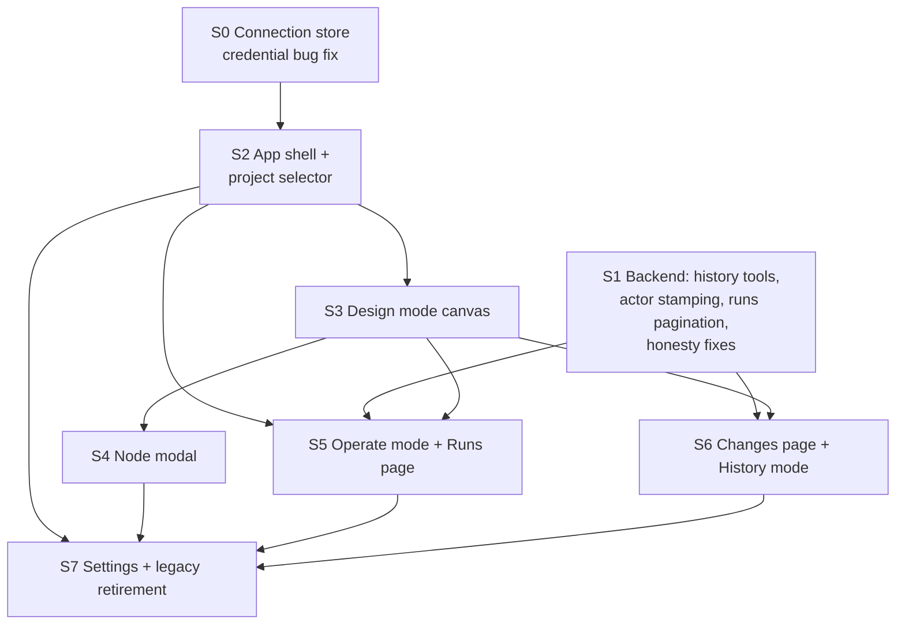

# Constellation redesign — migration plan

Sequenced plan from the current Overview/Builder/Nodes/Support UI to the
target product model (`product-model.md`). Each session is a shippable slice
that keeps the app working; legacy tabs coexist until their replacement is
proven, then retire. All engineering constraints hold throughout: MCP remains
the source of truth, all mutations pass through MCP tools, no
source-of-truth state lives only in React, semantic tokens only, no arbitrary
z-index, no overlapping absolute panels, MIT React Flow only.

## Migration path from Builder / Nodes / Support

| Today | Becomes | Notes |
|---|---|---|
| Overview | Overview | already attention-first; gains deep links into new pages |
| Builder ▸ graph | Constellation ▸ Operate (canvas + run overlay) | graph becomes truthful (dependsOn edges, MCP positions) |
| Builder ▸ WorkflowControls / RunStatus / NodeExecutionList | Runs page + Operate side rail | run ledger moves to Runs; live controls to Operate |
| Nodes ▸ Inspector / SkillsPanel / RJSF preview | Node modal (accordion sections) in Constellation ▸ Design | replaces raw-JSON textareas |
| Nodes ▸ NodeConsole | Node modal ▸ per-node inspect/execute drawer | keeps single-node dry execution |
| Nodes ▸ ArtifactPanel | Runs ▸ run detail ▸ artifacts | artifacts are run-scoped data |
| Support ▸ ConnectionPanel + diagnostics + exchange | Settings (Connection · Storage · Projects · Exchange) | connection store lands here |
| Support ▸ Validator + article schema | Node modal ▸ Schemas + a Tools drawer on Settings | validation is node-contract work |
| Support ▸ UsagePanel | Runs ▸ usage + Overview card | analytics requirements in `product-model.md` |
| — (new) | Changes page + Constellation ▸ History | requires history tools (S1) |

## Pre-shell technical debt (must land first)

These are the blockers identified in `data-model-gaps.md`; the shell migration
builds on them:

- **D1. Connection/credential unification** (UI) — **done (S0)**: explicit
  `McpConnection` discriminated union, call-time credential resolution via a
  stable ref-bound client (which also removes the stale-closure class the
  connection-epoch idea targeted), duplicate config in `useConnection`
  deleted, lazy per-request identity-JWT read, redaction at the error
  boundary. See `data-model-gaps.md` §1 Resolution.
- **D2. History read API + attribution** (backend): paginated
  `workspace.list_events` / `workspace.get_version`; server-stamped actor
  `{kind, id}`; meta required on all version-bumping mutations
  (import/stage/learning/skill.delete); stop node-snapshotting on non-node
  mutations. Unblocks Changes + History mode.
- **D3. Runs pagination/filtering** (backend): `workflow.list_runs`
  `{limit, cursor, status?, from?, to?}`; distinct pause vs approval-block;
  fix `run_node`/`run_all` dead contract surface. Unblocks the Runs page at
  scale.
- **D4. Honesty fixes** (small, parallel): real (or honestly relabeled)
  repository health probes; README/json-backend drift; usage `metadata`
  sanitization at the tool boundary; usage double-count fix.

D1 is UI-only and independent. D2/D3/D4 are backend and independent of D1.

## Implementation sessions

Session granularity follows the working procedure: one cohesive slice per
session, tests updated, typecheck/tests/ui build green, stop at the boundary.

- **S0 — Connection store & credential lifecycle (D1).** **Done.**
  Exit criteria met: repro from `data-model-gaps.md` §1 passes (token used
  immediately; Test connection and app agree; regression tests in
  `tests/ui/credentialLifecycle.test.ts` + `tests/ui/connection.test.ts`
  green). No visual redesign.
- **S1 — History & attribution backend (D2) + runs pagination (D3) + honesty
  fixes (D4).** Pure backend; can run parallel to S0. Exit: new tools covered
  by handler-level tests; existing tools unchanged for current UI.
  **Status: largely done.** Shipped: change history (revisions + events +
  `changes.*` tools with pagination), structured actor stamping, typed
  relationships + `constellation.*` read tools with derived metrics and
  evidence-cited attention, usage double-count fix. Remaining for a later
  slice: `workflow.list_runs` pagination/filtering, `usage.record` metadata
  sanitization, real repository health probes.
- **S2 — App shell.** Header with ProjectSelector + nav
  (Overview/Constellation/Runs/Changes/Settings), URL-addressable pages,
  legacy tabs reachable under Constellation/Settings as embedded legacy
  panels. UI test toolchain (jsdom + Testing Library, ui-scoped vitest
  project) lands here. Depends on S0. **Done.** Shipped: history-based
  routes (parse-only at load — identity hash tokens survive), quiet
  header selector (registered / seen-in-runs / stale-selection groups,
  localStorage preference scoping runs+usage), light/dark/system theme
  with indigo/teal/amber presets on the 25-token table (AA-validated in
  `tests/ui/theme.test.ts`), pre-paint theme hint, Runs/Changes honest
  placeholders, Appearance settings, ui-scoped vitest 3 + jsdom + RTL
  (`ui/tests/`). Deferred to S7: dark-mode literals in execution pills,
  flow nodes, budget states, RJSF/React Flow internals.
- **S3 — Constellation Design mode.** Truthful canvas (minimal node summary,
  dependsOn edges, MCP positions), selection rail, position/dependency
  editing with version guards. Depends on S2. **Done.** Shipped: Design
  canvas as the `/constellation` default (legacy panels stay under
  `?legacy=`), custom minimal node cards (no prompt text), edges derived
  from `dependsOn` + read-only stored data/policy layers, drag- and
  keyboard-move persistence via `workspace.update_graph {positions}`,
  dependency add/remove with local cycle pre-check (server authoritative),
  typed-confirmation delete via `update_graph {delete}` (atomic; canonical
  refusals surfaced verbatim), conflict banner with explicit
  reload-and-reapply, screen-reader list view, token-themed React Flow
  (`--xy-*-default` overrides). Decisions: canvas never sends
  `orderedNodeIds` (reorder rewrites `y`); `baseRevisionId` omitted from UI
  mutations (`expectedWorkspaceVersion` is strictly tighter); UI mutations
  now stamp `source: "ui"`; position moves mint revisions (honest history,
  no cosmetic carve-out); `getErrorMessage` unwraps the nested tool-error
  message so server refusals/conflicts surface verbatim.
- **S4 — Node modal.** Accordion sections 1–7 + 9 (`information-architecture.md`),
  replacing Inspector/SkillsPanel/NodeConsole flows; legacy Nodes tab
  retires. Depends on S3 (canvas selection), parallel-safe with S5.
- **S5 — Operate mode + Runs page.** Run ledger (paginated), run detail
  (nodes, artifacts, usage), live overlay + controls on the canvas; legacy
  Builder tab retires. Depends on S2 + D3; canvas overlay parts depend on S3.
- **S6 — Changes page + History mode.** Event ledger with filters and diffs;
  timeline scrubbing on the canvas; per-node restore
  (`workspace.restore_node_version`); modal ▸ History section appears.
  Depends on S1 + S3 (canvas) — ledger-only parts depend only on S1 + S2.
- **S7 — Settings consolidation & legacy retirement.** Connection · Storage ·
  Projects · Exchange; Support tab retires; delete `ui/src/mcpClient.ts`
  shim; finish token migration of legacy CSS; split styles per page.
  Depends on S2; final cleanup depends on S4–S6 having retired their tabs.

## Where the expanded product brief lands (no resequencing)

The expanded brief (supervisory-environment framing, influence taxonomy,
Operate encodings, 11 modal sections, theme system, evidence-based attention)
folds into the existing sessions rather than adding new ones:

- **S2** absorbs the GitHub-selector-spirit project switcher (upper-left,
  quiet, searchable, context-preserving) and the theme system foundation
  (light/dark/system modes, editable accent + curated presets, contrast
  validation over the token table, preference storage).
- **S3** absorbs stable-positions-for-spatial-memory as a hard constraint
  (Design owns layout; other modes never reflow) and relationship-kind
  filtering for the kinds that have data (execution, data, policy).
- **S4** ships the 11-section modal (Identity, Instructions, Model &
  execution, Inputs & outputs, Tools & MCP, Memory, Permissions, Budgets &
  limits, Evaluation, Activity, Change history) with honest placeholders for
  gap-backed sections (Memory, Permissions detail, Evaluation).
- **S5** ships Operate encodings only where data exists (node size from
  per-node usage, color+label health, run overlays); connector-thickness
  waits for per-edge activity aggregation (backend, tracked in
  `data-model-gaps.md` §4b) and joins later without resequencing.
- **S6** ships evidence-linked attention and changes: every attention item
  cites its evidence and deep-links to runs/changes/usage; the Changes ledger
  distinguishes human vs agent actors (requires S1 actor stamping).

## Dependency graph of sessions

Critical path: **S0 → S2 → S3 → S6 → S7**. S1 (backend) is off the UI
critical path until S5/S6 and should start immediately in parallel. S4 and S5
can proceed concurrently after S3.

## Rollback / coexistence strategy

- Every session ships behind the existing tab structure until its replacement
  page reaches parity; a legacy tab is removed only in the same session that
  proves parity (S4 for Nodes, S5 for Builder, S7 for Support).
- No storage migrations are required by the UI work; S1's new tools are
  additive. If S1's version-semantics change (no snapshots on non-node
  mutations) proves risky, it can be deferred — the Changes page then filters
  no-op events client-side as a temporary measure.
- Each session ends with: `npm run typecheck`, `npm test`, `npm run ui:build`,
  plus the per-session gates in `test-strategy.md`.
