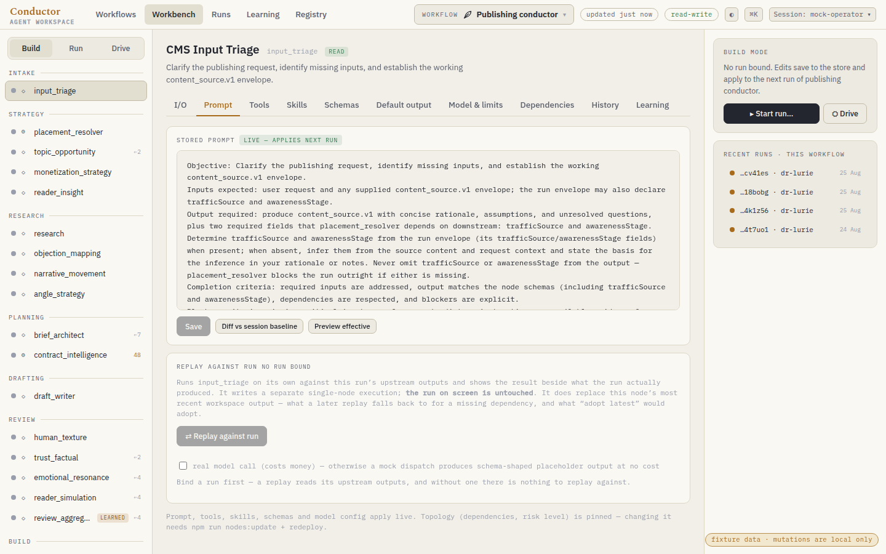
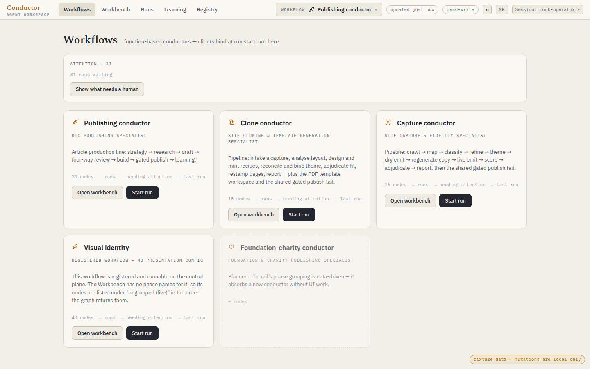
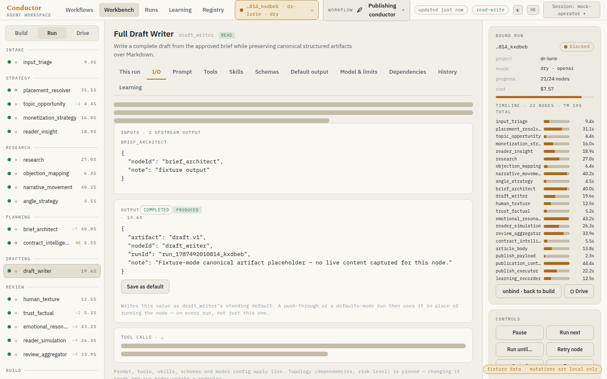
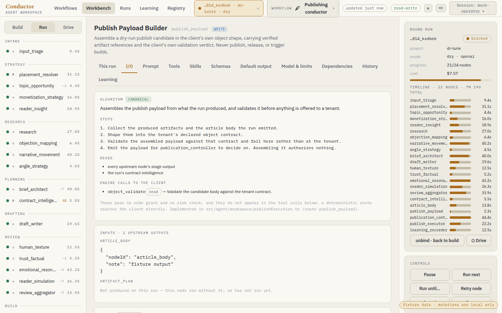
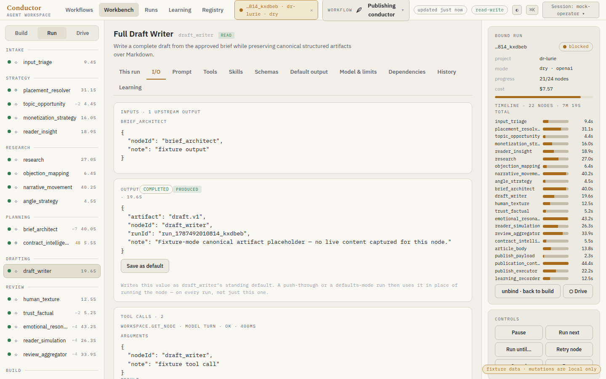
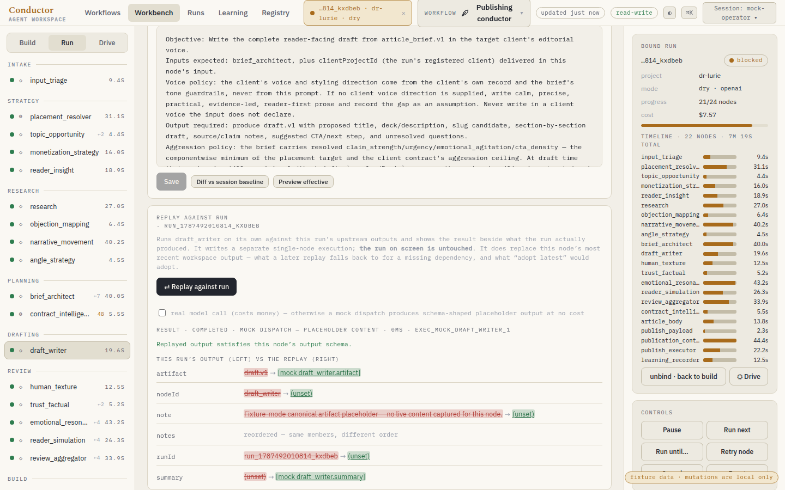
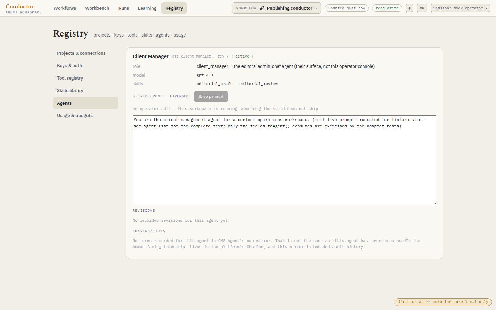
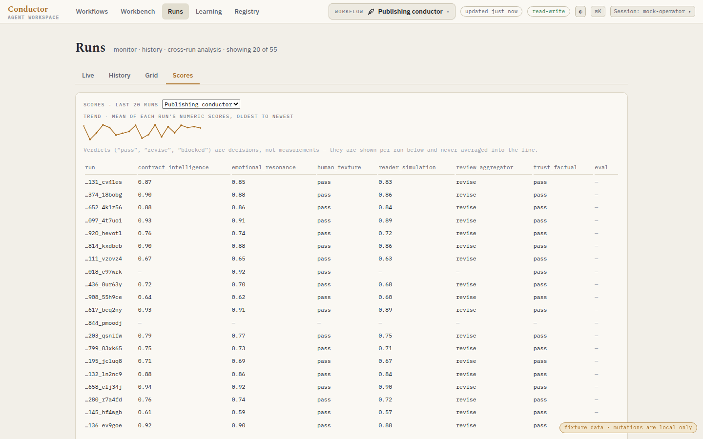
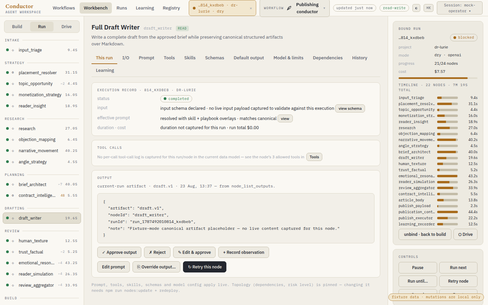

# Workbench v2 — what changed, and what it cost

Branch `feat/workbench-v2`, off `main` at c010d69. Eight waves, W0 through W7, each with its own
commit and its own acceptance test. The full measurement narrative — hypotheses, what survived
contact with a measurement and what did not — is in
[`docs/perf/workbench-2026-09-16.md`](../../docs/perf/workbench-2026-09-16.md); this file is the
short account.

## Measured, before and after

| | before | after | how it was measured |
|---|---|---|---|
| burst of 15 concurrent reads — GCS round trips | 30 | **2 cold, 0 warm** | `npm run perf:store-burst` |
| the same burst — bytes downloaded | 4.71 MB | **0.31 MB cold, 0 MB warm** | same |
| first paint — verb calls before the rail is interactive | 15 | **2** | `workbench/contracts/first-paint.json` + Playwright |
| first paint — bytes | ~340 KB | **< 40 KB** | same |
| second visit | 15 calls again | **0 calls, painted from the persisted cache** | Playwright |
| `workspace_get_nodes` for 51 nodes | ~310 KB (full rows) | **19 KB** (`detail: "summary"`) | contract test |
| `workflow_list_runs {limit: 50}` | full run records | **≤ 20 KB summary rows** | contract test |

Two rows are deliberately absent. The live harness (`npm run perf:workbench-load`, which measures
warm `workspace_get_node` latency, the p95 of a live 15-verb burst and `workflow_list_runs` warm)
**ships unrun**: this environment has no `CMS_AGENT_MCP_TOKEN` and no working GCP credential, so
`/mcp` answers 401 and Secret Manager answers 401. Nothing was worked around to get one. The
offline harness above was built to reproduce the same behaviour against the real
`BlobWorkspaceRepository` → `GcsStoreClient` path with a counting bucket, so the round-trip claims
are measured rather than argued — but the latency claims are not, and are not asserted anywhere.

## What each wave did

**W0 — measure first.** Two harnesses, a 15-verb first-paint contract file, and a written record of
which hypotheses the measurements supported. H1 (the store re-reads a 321 KB document per verb) was
confirmed, but with a corrected mechanism: the cost is round trips, not re-parse CPU. H3 (cold
starts) was weakened — `/health` answered in 160 ms.

**W1 — the server stops re-reading a document that never changed.** A micro-TTL + generation-check
cache with in-flight coalescing under `BlobWorkspaceRepository.load()`, and the same shape under the
project, evaluation and skill repositories. Writes adopt, CAS rejections invalidate, and every read
hands out a `structuredClone` so no caller can mutate the cached document. `mutate()` always reads
fresh — a CAS funnel that read from a cache would be a correctness bug, not an optimisation.
H2 (a swallowed run-index heal write, the best explanation for a 23-second listing) was made loud,
verified and remembered rather than retried forever.

**W2 — stop sending a list the things only an inspector reads.** `detail: "summary"` on
`workspace_get_nodes`, opt-in `include` on `workflow_list_runs`, and response-level interning of the
repeated mode block. The summary projection measured **19 KB, not the 11 KB the plan estimated**;
the number in the contract is the measured one.

**W3 — first paint is one round trip.** `workbench.bootstrap` answers what the shell needs in one
call; the query cache persists for 24 hours keyed by workspace and busted by build id. Found on the
way: ⌘K's index and the attention strip's queries fired unconditionally on every cold load, and three
separate graph downloads were being made to display three integers.

**W4 — the rail drives the run.** Push-through from any queued node's row; the I/O tab (inputs,
output, tool calls); and the Algorithm panel, which is the only explanation a deterministic node has
— it has no prompt and no grants by construction, and the Workbench had been showing operators a
node that crawls a site or publishes a template and telling them nothing about it.

**W5 — the Client Manager, and scores.** The agent every editor's admin chat talks to gets a page,
including what it has actually been saying (`agent.list_conversations`, bounded twice, reporting
tool calls as proposals because CMS-Agent never executes one). Run scores are extracted at index
time, so a page of them opens no run records; a node that recorded nothing is absent, never zero.

**W6 — the test-and-learn loop.** Save a produced output as the node's default; replay a node against
a run and diff the result against what that run produced. Both sit on verbs that already existed and
that nothing in the Workbench called.

**W7 — re-measure and close.** The table above, these screenshots, and this file.

## Surfaces added

Captured from the fixture plane by `npx playwright test --config playwright.screenshots.config.ts`,
which is deliberately outside `playwright.config.ts`'s `testDir` so CI never takes screenshots as
part of the acceptance suite.

## Defects found that the plan did not anticipate

- `requiredInputs` is a list of required input **artifact types**, not the dependency list, and
  diverges from `dependsOn` on `input_triage`. W4's I/O tab read it as node ids. Fixed in W6.
- The inspector rendered the previous node's configuration under the new node's name — latent,
  exposed when the node list became a summary projection.
- Saving a default output did not invalidate the rail's node rows, so the rail kept insisting the
  node had none.
- Five registered workflows were invisible in the deck, because the deck filtered the catalog by a
  hand-written config list.
- The fixture plane's `workspace_adopt_output_as_default` returned `{node: null}` where the live tool
  throws `node_output_unavailable`, so a save that never happened reported success.
- `node_execute` was missing from `MUTATING_VERBS`.
- The Scores table reused the run grid's `.grid` class, whose rotated vertical headers are meant for
  one-glyph columns; the node names printed sideways into the paragraph above them.

## Where the numbers came from

`npm run perf:store-burst` (offline, counting bucket, real repository path) and the Playwright
contract tests in `workbench/tests/firstPaintBudget.spec.ts` against
`workbench/contracts/first-paint.json`. `npm run perf:workbench-load` is the live harness and has not
been run; it refuses to accept a token on the command line, and reads `CMS_AGENT_MCP_URL` /
`CMS_AGENT_MCP_TOKEN` from the environment.
